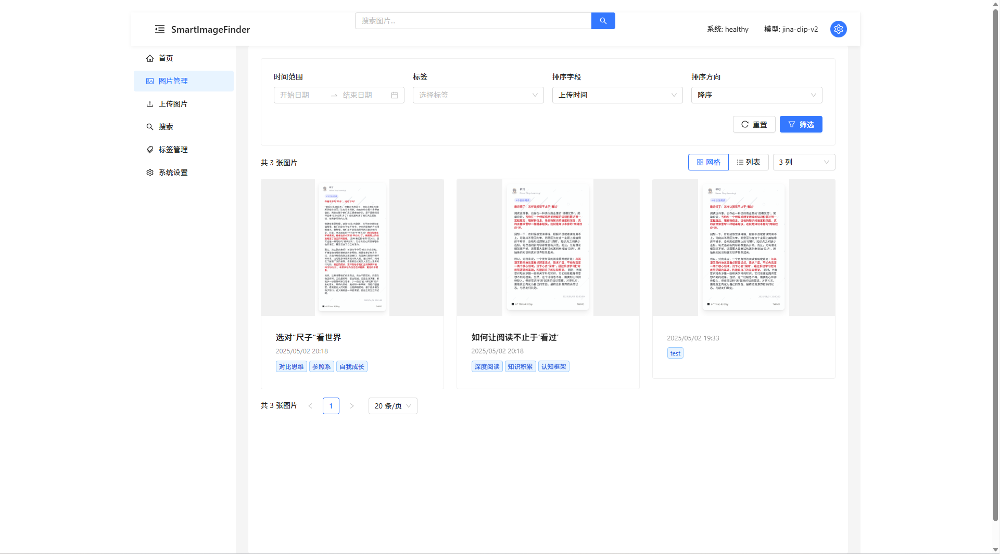
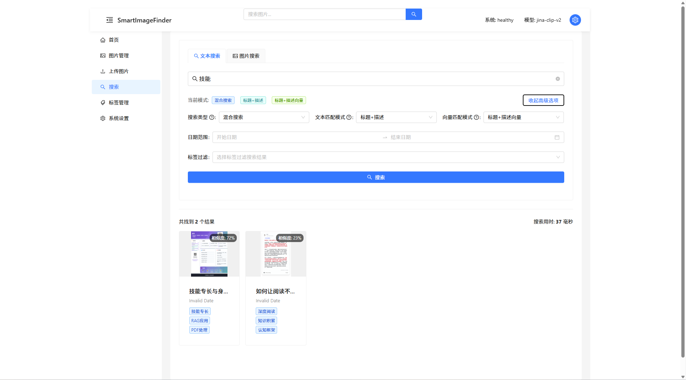
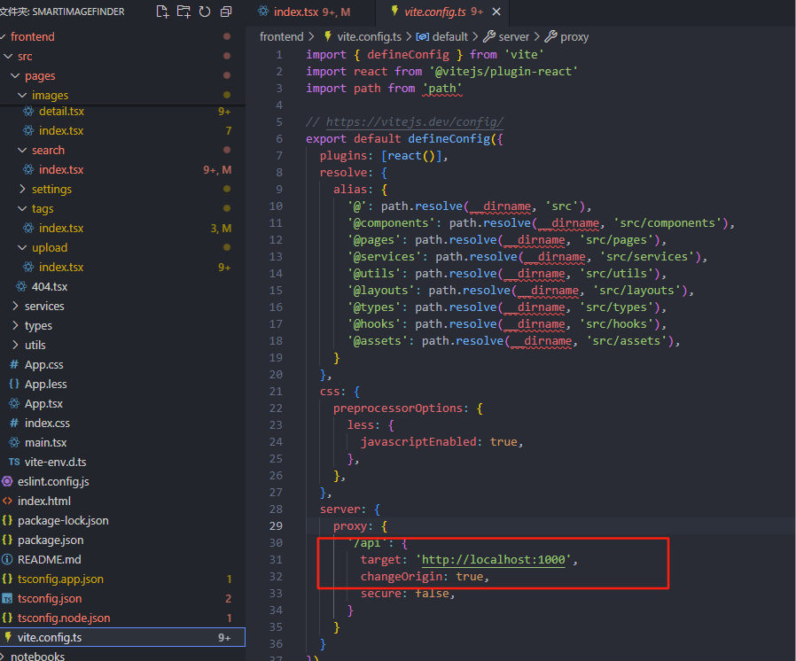
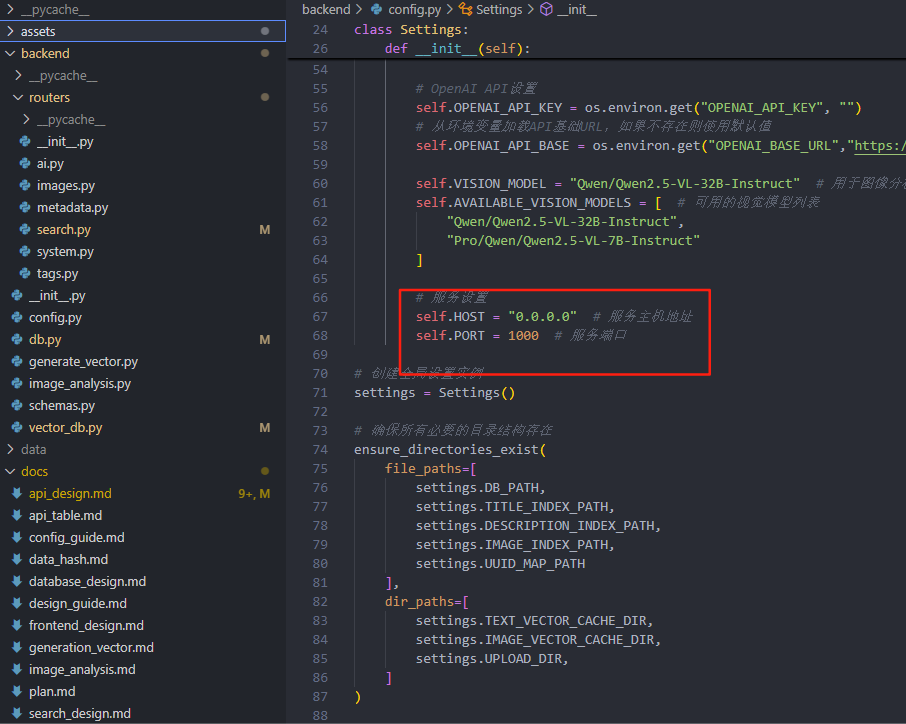
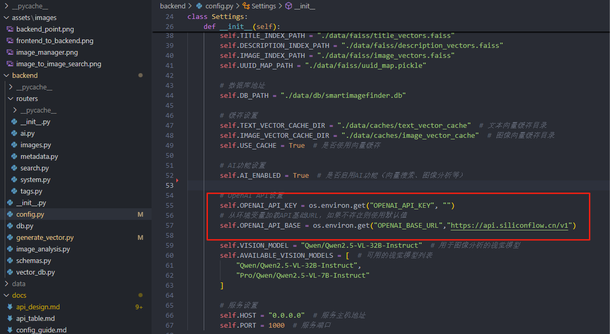

# SmartImageFinder

一个基于多模态向量模型及视觉多模态模型构建的图片搜索引擎管理系统，实现精准的以文搜文，文搜图、以图搜图多种智能检索方式。


## 功能特点



- 基于文本的语义搜索
- 基于文本的图片语义搜索
- 基于图片的相似图片搜索
- 自动生成图片标题、描述和标签
- 支持按标签和元数据筛选图片
- 适用于本地存储的图片集合管理

## 技术栈

- **后端**: FastAPI, Python 3.10+
- **前端**: React 18, Ant Design 5
- **向量数据库**: Faiss + Sqlite
- **向量生成**: Jina CLIP V2
- **多模态内容生成**: Qwen/Qwen2.5-VL-32B-Instruct

## 快速开始

### 环境要求

- Python 3.10+
- Node.js 16+

### 后端设置

1. 安装依赖:

```bash
cd backend
pip install -r requirements.txt
```

2. 复制环境变量示例并编辑:

```bash
cp .env.example .env
# 编辑 .env 文件填写必要的配置
```

4. 启动后端服务器:

```bash

python main.py
```

服务将在 <http://localhost:1000> 上运行，API文档可在 <http://localhost:1000/docs> 上查看。

### 前端设置

1. 安装依赖:

```bash
cd frontend
npm install
```

2. 启动开发服务器:

```bash
npm run dev
```

前端将在 <http://localhost:5173> 上运行。

## 文档

### 修改前端发送给后端的地址在vite.config.ts下面



### 修改后端端口的地址在config.py里面进行修改



### 多模态模型配置可以在环境变量配置，或者在config.py文件下进行配置


更多详细信息，请参阅 [docs/](./docs/) 目录下的文档。

## 许可证

本项目采用 [Apache 许可证 2.0](LICENSE) 进行许可。
