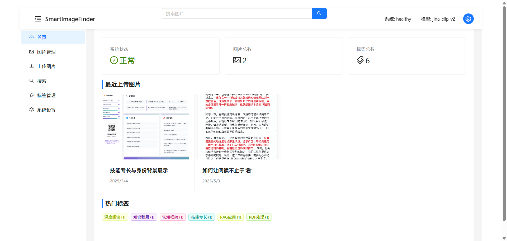
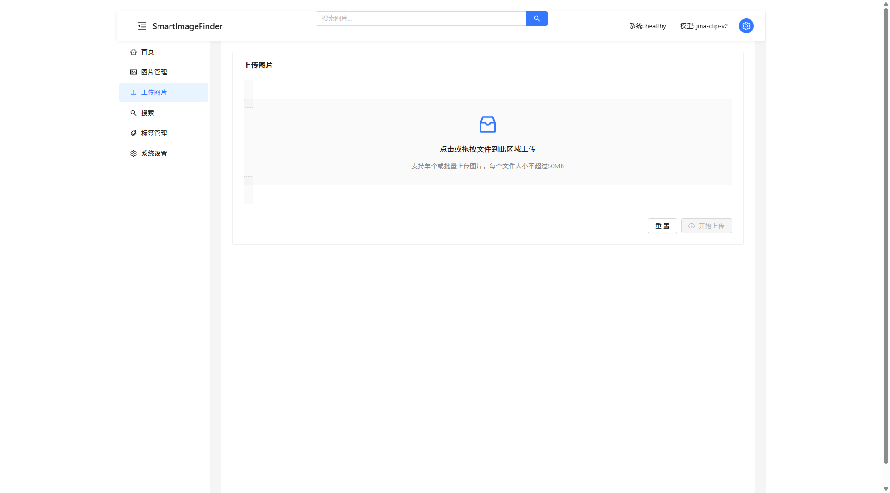
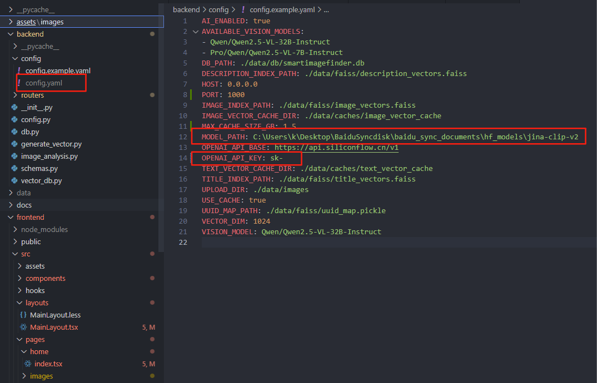

# SmartImageFinder



一个基于多模态向量模型及视觉多模态模型构建的智能图片搜索引擎和管理系统，实现精准的以文搜图、以图搜图等多种智能检索方式，并提供完整的图片管理解决方案。

## 功能特点

### 智能搜索

- **语义化文本搜索**：支持模糊匹配、向量搜索和混合搜索模式
- **以图搜图**：基于图像特征向量的相似图片搜索
- **多维度过滤**：按标签、日期和元数据属性进行精细化筛选

### 图片管理


- **批量上传**：支持多图片同时上传
- **智能标注**：自动生成图片标题、描述和标签
- **元数据管理**：存储和编辑图片的详细元数据
- **标签系统**：灵活的标签管理和分类

### 多模态AI分析


- **图像内容理解**：使用视觉多模态模型分析图像内容
- **自动标签生成**：基于图像内容智能推荐标签
- **向量索引**：维护高效的图像和文本向量索引

### 用户界面

- **响应式设计**：适配不同设备的界面
- **直观操作**：拖放上传、预览和编辑
- **批量操作**：支持图片批量处理功能
- **系统设置**：可配置缓存、API和存储选项

## 使用场景

- 个人照片管理和搜索
- 设计资源库和素材管理
- 产品图库和电商图片管理
- 科研图像数据集整理与检索
- 任何需要智能图像搜索的应用场景

## 技术架构

### 后端

- **框架**：FastAPI (Python 3.10+)
- **数据存储**：
  - SQLite：存储图片元数据和标签
  - FAISS：高性能向量索引与检索
- **向量模型**：Jina CLIP V2
- **多模态内容生成**：Qwen/Qwen2.5-VL-32B-Instruct
- **缓存机制**：向量缓存提高重复查询效率

### 前端

- **框架**：React 18 + TypeScript
- **UI组件库**：Ant Design 5
- **构建工具**：Vite
- **状态管理**：React Hooks
- **路由**：React Router 6

## 核心功能展示

### 图片上传



### 图片编辑


### 图像搜索


## 快速开始

### 环境要求

- Python 3.10+
- Node.js 16+
- 足够的磁盘空间用于存储图片和向量索引

### 后端设置

1. 克隆仓库:

```bash
git clone https://github.com/li-xiu-qi/SmartImageFinder.git
cd SmartImageFinder
```

2. 安装依赖:

```bash
pip install -r requirements.txt
```

3. 配置系统:

```bash
# 复制默认配置
cp backend/config/config.example.yaml backend/config/config.yaml
# 根据需要编辑配置文件
```

4. 启动后端服务:

```bash
python main.py
```

服务将在 <http://localhost:1000> 上运行，API文档可在 <http://localhost:1000/docs> 上查看。

### 前端设置

1. 安装依赖:

```bash
cd frontend
npm install
```

2. 启动开发服务器:

```bash
npm run dev
```

前端将在 <http://localhost:5173> 上运行。

## 系统配置

### 前端配置

修改前端API请求地址在 `vite.config.ts` 文件中:


### 后端配置

系统核心配置在 `backend/config.py` 和配置文件中:


## 系统架构

### 数据流程

1. 图片上传 → 保存到文件系统
2. 提取图片向量 → 存入FAISS索引
3. 图片元数据和标签 → 存入SQLite数据库
4. 搜索请求 → 向量检索 + 数据库过滤 → 返回结果

### 目录结构

```
SmartImageFinder/
├── assets/             # 静态资源和示例图片
├── backend/            # 后端代码
│   ├── config/         # 配置文件
│   ├── routers/        # API路由
│   └── ...             # 核心模块
├── data/               # 数据目录
│   ├── caches/         # 向量缓存
│   ├── db/             # 数据库
│   ├── faiss/          # 向量索引
│   └── images/         # 图片存储
├── docs/               # 项目文档
└── frontend/           # 前端代码
    ├── public/         # 静态资源
    └── src/            # React源代码
```

## 扩展开发

### 添加新功能

- 见 `docs/` 目录下的开发指南文档

### 自定义模型

- 系统支持自定义替换向量模型和视觉模型
- 修改 `config.yaml` 中的相关配置

## 文档

详细的系统文档:

- [API设计](docs/api_design.md)
- [数据库设计](docs/database_design.md)
- [搜索设计](docs/search_design.md)
- [前端设计](docs/frontend_design.md)
- [系统配置指南](docs/config_guide.md)

## 许可证

本项目采用 [Apache 许可证 2.0](LICENSE) 进行许可。
