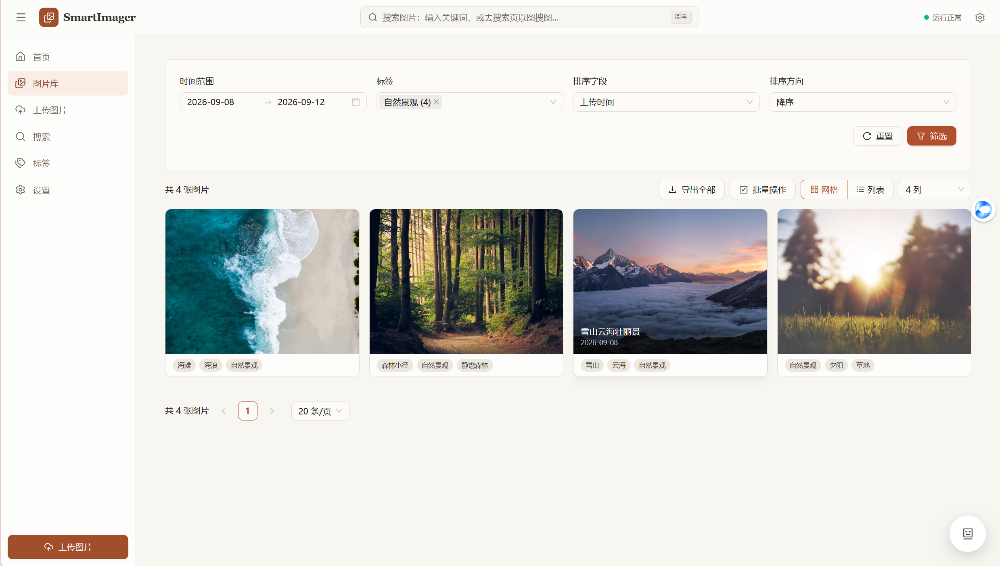
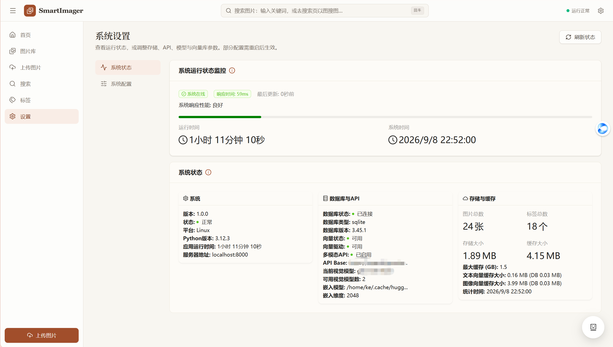

<div align="center">
  
  <h1>SmartImager</h1>

  <p>智能图片搜索 / 管理与 AI 对话式推荐系统</p>

  <div>
    <a href="LICENSE"></a>
    
    
    
  </div>

  <div>
    <a href="README.md">中文</a> |
    <a href="README_EN.md">English</a>
  </div>
</div>

## 项目概述

SmartImager 是一个现代化的智能图片搜索与管理系统，采用 **Next.js 全栈 + 独立推理服务** 架构：业务层（前端页面、REST API、本地 SQLite）运行在 Next.js 中，向量编码、向量检索与图像分析由独立的 Python 推理服务承担。系统集成向量语义检索、以图搜图、模糊检索与对话式 AI 推荐，默认内置多模态/文本统一向量模型为 Jina Embeddings v4（替代原 Jina CLIP V2），提供更高质量的语义表示。

## 🏗️ 系统架构

### 架构概览


SmartImager 按**一体化部署**设计：业务层与 AI 计算默认跑在同一台机器，本地 SQLite 直接读写，开箱即用。

整套系统分四层。**展示层**是前端 7 页面（首页 / 图片库 / 上传 / 搜索 / 标签 / 设置 / 404）。**业务层**是 Next.js 全栈，`/api/v1/*` 即后端接口，配本地 SQLite 存图片元数据、会话与标签。**AI 推理层**是 Python 推理服务（`:8100`），持有 jina-embeddings-v4 编码模型、sqlite-vec 向量库与 glm 视觉模型，提供编码、向量检索与图像分析能力。

在一体机部署下，业务层与 AI 推理层同机运行，业务层通过进程内调用直连推理层。当需要 GPU、大内存等专用算力时，架构**原生支持**把整个 AI 推理层卸载到第二台机器（通过 HTTP `:8100` 通信），业务层无需改动代码，只需修改推理服务地址即可。

## 功能特性

### 🖼️ 图片管理

- **图片浏览** - 直观的网格布局和图片预览功能
- **标签系统** - 强大的多标签分类和筛选管理
- **元数据编辑** - 灵活的标题、描述和自定义标签管理
- **批量操作** - 高效的批量上传、分析和标签管理
- **拖拽上传** - 支持多文件选择和拖拽上传

### 🔍 智能搜索

- **文本搜索** - 基于自然语言描述的图片检索
- **图片搜索** - 以图搜图，查找相似内容
- **向量搜索** - 基于标题、描述和图片内容的多维度搜索
- **相似搜索** - 基于参考图片的相似性检索
- **过滤搜索** - 支持标签和时间的组合过滤
- **模糊搜索 (Fuzzy LIKE)** - 轻量关键词 LIKE 匹配，适合快速匹配式搜索

#### 💬 对话式图片搜索（Chat-driven Image Retrieval）

基于对话的多轮图片智能检索与推荐：

- **多轮上下文记忆**：基于 `conversation_id` 绑定会话历史，消息按时间正序存取
- **查询处理**：用户输入直接编码为查询向量，多路召回（标题 / 描述 / 图片内容）
- **分阶段流程**：召回 → 相似度聚合 → 生成回复
- **SSE 流式输出**：事件包括 `rewrite_start` / `assistant_delta` / `complete` / `error`
- **会话管理**：支持创建 / 列出 / 删除会话，`conversation_id` 绑定上下文
- **结果增强**：返回图片精简信息（id/score/title/tags/public_url）+ 选中图片ID列表

主要接口：

| 功能 | 方法 | 路径 |
|------|------|------|
| 创建会话 | POST | `/api/v1/ai/conversations/create` |
| 列出会话 | GET  | `/api/v1/ai/conversations` |
| 删除会话 | DELETE | `/api/v1/ai/conversations/{conversation_id}` |
| 获取会话消息 | GET | `/api/v1/ai/conversations/{conversation_id}/messages` |
| 对话式推荐（一次性） | POST | `/api/v1/ai/recommend/chat` |
| 对话式推荐（SSE流） | POST | `/api/v1/ai/recommend/chat/stream` |

请求示例（流式推荐，端口以启动日志为准；Next.js 全栈默认 :3000）：

```bash
curl -N -X POST http://localhost:3000/api/v1/ai/recommend/chat/stream \
  -H "Content-Type: application/json" \
  -d '{
    "conversation_id": "demo-session-1",
    "query": "给我找一些蓝色天空下的城市建筑照片",
    "vector_targets": ["title_vector", "desc_vector", "image_vector"],
    "limit": 12
  }'
```

SSE 返回关键事件（示例）：

```text
event: rewrite_start
data: {"message":"start","conversation_id":"demo-session-1"}

event: assistant_delta
data: {"delta":"正在为你检索相关图片..."}

event: complete
data: {"image_ids":[12,8,5,...],"assistant_text":"已为你找到...","images_brief":[...]} 
```

前端可基于事件类型实时渲染“AI思考中 / 追加回答 / 展示图片结果”等状态，带来顺滑的交互体验。

### 🤖 AI分析功能

- **自动分析** - 基于 glm-4.6v-flash 视觉模型的图片内容理解
- **智能标注** - 自动生成图片标题、描述和标签
- **批量处理** - 支持大规模图片的批量AI分析
- **向量化** - 基于 jina-embeddings-v4 的文本/图片统一向量编码（2048 维）

### 🎨 用户界面

- **现代化设计** - 基于 React 18 + shadcn/ui 的暖白画廊风格界面
- **响应式布局** - 完美适配桌面端和移动端
- **实时交互** - 支持图片预览、缩放和编辑操作
- **状态监控** - 实时显示处理进度和系统状态
- **系统管理** - 完善的配置管理和监控界面

#### 界面总览

<table>
  <tr>
    <td align="center" width="50%"><b>界面总览</b></td>
    <td align="center" width="50%"><b>原版本</b></td>
  </tr>
  <tr>
    <td></td>
    <td></td>
  </tr>
</table>

#### 主要页面

<table>
  <tr>
    <td align="center" width="33%"><b>首页</b></td>
    <td align="center" width="33%"><b>图片库</b></td>
    <td align="center" width="33%"><b>图片详情</b></td>
  </tr>
  <tr>
    <td></td>
    <td></td>
    <td></td>
  </tr>
  <tr>
    <td align="center"><b>上传图片</b></td>
    <td align="center"><b>智能搜索</b></td>
    <td align="center"><b>标签管理</b></td>
  </tr>
  <tr>
    <td></td>
    <td></td>
    <td></td>
  </tr>
  <tr>
    <td align="center"><b>标签筛选</b></td>
    <td align="center"><b>系统设置</b></td>
    <td></td>
  </tr>
  <tr>
    <td></td>
    <td></td>
    <td></td>
  </tr>
</table>

## 🎯 核心技术特点

- **🧠 对话式推荐** - 支持多轮上下文（基于 `conversation_id` 绑定会话历史）+ 多路向量召回
- **🛡️ 向量目标白名单** - 防止非法表名/注入导致的表不存在错误
- **🔌 流式SSE输出** - AI 推荐过程逐步推送（改写、搜索、结果）提升交互体验
- **⚡ 高性能向量检索** - SQLite + sqlite-vec 轻量级向量数据库，毫秒级搜索响应
- **🧠 先进的AI模型** - 集成 Jina Embeddings v4 模型（支持文本/图片多模态向量），相比旧版 Jina CLIP V2 召回与语义表示更优
- **🎨 现代化技术栈** - Next.js 16 + React 18 + TypeScript + shadcn/ui + Tailwind CSS，确保代码质量和开发体验
- **🔧 独立推理服务** - 向量编码、向量检索、图像分析独立部署，可单独重启，不拖累业务层启动
- **🔄 离线向量模型迁移** - 提供可断点续传的离线脚本 `migrate_embeddings.py`，支持自动探测维度 / 新旧维度差异判定 / 原子切换 `*_vectors` 虚表 / 缓存目录安全替换，并在完成后自动更新主配置的 `MODEL_PATH` 与 `EMBEDDING_DIMENSION`。

### 🔄 向量模型迁移（Embedding Model Migration）

当你需要将当前使用的向量模型（例如从 Jina CLIP V2 升级为 Jina Embeddings v4，或切换到任意其他本地 / HuggingFace 模型）并重新生成图片 / 标题 / 描述三类向量时，可使用根目录脚本：

```bash
python migrate_embeddings.py            # 使用默认配置
python migrate_embeddings.py --resume   # 中断后续传
```

关键特性：

- 自动判定是否需要创建 `*_vectors_new`（维度变更才建新表，完成后原子切换）
- 分批处理 + `model_migrations` 表记录进度，可断点续传
- 避免 UPSERT 不支持：使用 INSERT OR IGNORE + UPDATE 兼容写入 sqlite-vec 虚表
- 成功后自动更新推理服务配置中模型路径与新维度
- 旧缓存目录自动重命名为 `*_old`，便于回滚 / 清理

运行前务必：停止推理服务并备份数据库文件（详见 `docs/model_migration.md`）。

> **注意**：迁移脚本默认读取 `backend/config/files/migration.yaml`。旧 `backend/` 已归档至 `Smartlmager-suite/archive/backend-fastapi-legacy/`，运行前需用 `--config` 显式指定配置文件路径，或将所需配置复制到可访问位置。

更多细节、配置字段与回滚策略参见：`docs/model_migration.md`。

## 🚀 快速开始

SmartImager 支持**一体化部署**：业务层（Next.js 全栈）与 AI 推理层（Python 推理服务）既可同机运行，也可把推理层卸载到另一台算力机。下文按「业务层 + 推理层」两部分说明，两者独立启动。

### 方式一：Next.js 全栈版本（当前主版本）

业务层已全部迁至 Next.js，前端页面、REST API、本地 SQLite 都在其中。

```bash
# 1. 进入 Next.js 应用目录
cd next-app

# 2. 安装依赖（注意：本机 NODE_ENV 为 production 时必须显式覆盖，否则 devDependencies 不安装）
NODE_ENV=development npm install

# 3. 启动开发服务器（--webpack 必须带，Turbopack 在请求编译阶段会无限等待）
NODE_ENV=development npx next dev --port 3000 --webpack
```

启动后访问 <http://localhost:3000>。

> 推理服务需另行启动（见方式二），否则上传分析、向量搜索等 AI 功能不可用，页面会给出降级提示。

### 方式二：Python 推理服务（远程，AI 能力依赖）

推理服务持有 jina-embeddings-v4 模型、sqlite-vec 向量库与 glm 视觉模型，通过 HTTP（`:8100`）向上提供能力。

```bash
# 推理服务可运行在本机或远程算力机（如 dgx-spark）
# 环境准备、模型加载、.env 配置、vec0.so 驱动适配、启动命令等
# 详见 docs/推理服务独立-拆分设计.md
```

推理服务提供以下接口（`:8100`）：

| 功能 | 方法 | 路径 |
|------|------|------|
| 健康检查 | GET | `/health` |
| 文本/图片编码 | POST | `/encode` |
| 向量写入 | POST | `/vectors/add` |
| 向量检索 | POST | `/vectors/search` |
| 向量统计 | GET | `/vectors/stats` |
| 图像分析 | POST | `/analyze` |

### 启动检查清单

- Next.js 全栈：`curl http://localhost:3000` 应返回首页 HTML
- 推理服务：`curl http://<推理服务主机>:8100/health` 应返回 `{"status":"ok","model_loaded":true,...}`
- 端到端：上传一张图，能自动生成标题/描述/标签即表示全链路通畅

### 端口与代理配置（重要）

- **Next.js 全栈**：默认 `:3000`，通过 `npx next dev --port` 指定
- **推理服务**：默认 `:8100`，通过推理服务侧环境变量 `INFERENCE_PORT` 指定
- **Next.js 到推理服务**：默认指向 `http://<远程主机>:8100`，具体目标见 `next-app/src/lib/inference.ts` 与 `next-app/.env`
- **向量数据库与模型路径**：由推理服务侧 `.env`（`VECTOR_DB_PATH`、`VECTOR_DB_DRIVER`、`MODEL_PATH` 等）配置，与 Next.js 解耦


## 应用场景

- **个人图片管理** - 智能整理和检索个人照片库
- **设计素材管理** - 高效管理和搜索设计资源
- **内容创作** - 为创作者提供智能图片检索服务

## 🛠️ 技术架构

### 总体拓扑

两个独立节点，通过 HTTP 通信：

- **Next.js 全栈（本机 :3000）**：前端 + 业务 API + 本地 SQLite
- **Python 推理服务（远程 :8100）**：向量编码 + 向量检索 + 图像分析

### Next.js 全栈（`next-app/`）

- **Next.js 16（App Router）** - 前端页面与 Route Handlers 同仓，`/api/v1/*` 即后端接口
- **React 19 + TypeScript** - 界面与类型
- **shadcn/ui + Tailwind CSS** - UI 组件层与样式（暖白画廊风格）
- **better-sqlite3** - 本地 SQLite，存图片元数据、会话、标签
- **Lucide** - 图标

前端 7 页面：首页、图片库、上传、搜索、标签、设置、404。

### Python 推理服务（远程 :8100）

- **jina-embeddings-v4** - 文本/图片统一向量编码（默认 2048 维）
- **sqlite-vec** - 轻量级向量数据库，毫秒级近邻搜索
- **glm-4.6v-flash** - 多模态视觉模型，图片内容理解与标注
- **FastAPI + uvicorn** - 推理服务自身框架
- **独立部署** - 持有模型与向量库，通过 `/encode`、`/vectors/*`、`/analyze` 向上提供能力，可单独重启

### 核心能力

- **向量搜索引擎** - 统一向量语义搜索（文本 / 图片 / 直接向量 / 相似）
- **AI分析引擎** - 图片内容自动分析与标注（标题 / 描述 / 标签）
- **标签管理系统** - 智能标签分类和管理
- **配置管理** - 推理服务侧 `.env` 自加载，与业务层解耦

## 🖥️ 系统要求

### 支持平台

- **Windows**: x86_64
- **Linux**: x86_64, aarch64  
- **macOS**: x86_64 (Intel), aarch64 (Apple Silicon)

## 📁 项目结构

```
SmartImager/
├── next-app/                     # Next.js 全栈（前端 + 业务 API + 本地 SQLite）
│   ├── src/
│   │   ├── app/                  # 页面与路由
│   │   │   ├── page.tsx          # 首页
│   │   │   ├── images/           # 图片库
│   │   │   ├── upload/           # 上传
│   │   │   ├── search/           # 搜索
│   │   │   ├── tags/             # 标签
│   │   │   ├── settings/         # 设置
│   │   │   ├── not-found.tsx     # 404
│   │   │   └── api/v1/           # 业务 API Route Handlers
│   │   │       ├── images/       #   图片 CRUD / 上传 / 导出 / 文件服务
│   │   │       ├── tags/         #   标签
│   │   │       ├── search/       #   相似搜索
│   │   │       ├── system/       #   系统状态 / 配置
│   │   │       └── ai/           #   会话 + 对话式推荐（SSE）
│   │   ├── components/           # UI 组件（layout / ui / ai / GalleryImageCard 等）
│   │   ├── lib/                  # db.ts（better-sqlite3）、inference.ts（推理服务客户端）
│   │   └── services/             # api.ts、chatService.ts、searchClient.ts
│   ├── data/                     # 本地 SQLite（smartimager.db）与上传图片
│   ├── next.config.js            # serverExternalPackages + API 代理 rewrites
│   ├── tailwind.config.cjs       # Tailwind 配置（CommonJS，因 package.json 为 ES module）
│   ├── MIGRATION-NOTES.md        # 迁移范式与状态记录
│   └── package.json              # Next.js 16 + React 19 + TypeScript
├── assets/                       # Logo 等静态资源
├── docs/                         # 架构图、截图、设计文档
│   ├── 架构图.png / 架构图.dot    #   系统架构图（源文件为 Graphviz DOT，dot 渲染导出）
│   ├── screenshots/              # 界面截图
│   └── 推理服务独立-拆分设计.md    #   推理服务拆分方案
├── main.py                       # 旧一体化后端入口（已归档，保留兼容）
├── start.py                      # 旧一键启动脚本（已归档，保留兼容）
├── migrate_embeddings.py         # 离线向量模型迁移脚本（可断点续传）
├── scripts/                      # 环境与启动辅助脚本
├── templates/                    # 模板文件
├── requirements.txt              # Python 依赖（推理服务 / 迁移脚本用）
└── README.md                     # 项目说明
```

> 旧的 `frontend/`（React + Ant Design）与 `backend/`（FastAPI）已移出本仓库，归档至同级 `Smartlmager-suite/archive/`，需要时从该处取回。

## 🔧 详细配置

### 服务端口

- **Next.js 全栈**：`3000`（默认），通过 `npx next dev --port` 指定
- **Python 推理服务**：`8100`（默认），通过环境变量 `INFERENCE_PORT` 指定

### 关键配置

**Next.js 侧**（`next-app/.env` 或环境变量）：

| 变量 | 默认值 | 说明 |
|------|--------|------|
| `INFERENCE_SERVICE_URL` | `http://192.168.1.170:8100` | 推理服务地址 |
| `DB_PATH` | `next-app/data/smartimager.db` | 本地 SQLite 路径 |

**推理服务侧**（`inference_service/.env`，自加载）：

| 变量 | 说明 |
|------|------|
| `MODEL_PATH` | jina-embeddings-v4 模型快照路径 |
| `VECTOR_DB_DRIVER` | sqlite-vec `vec0.so` 驱动路径 |
| `GLM_API_KEY` | 智谱 API Key（glm-4.6v-flash 视觉 / glm-4.7-flash 文本） |
| `OPENAI_API_BASE` | 智谱 OpenAI 兼容端点 |
| `VISION_MODEL` / `CHAT_MODEL` | 视觉 / 文本模型名 |

> `VECTOR_DB_PATH`（向量数据库文件路径）与 `INFERENCE_PORT` 在启动命令中以环境变量传入，未写入 `.env`。

### 💡 使用提示

#### 服务访问地址

- **主前端界面**: <http://localhost:3000>
- **推理服务健康检查**: <http://localhost:8100/health>

## 📊 系统监控与管理

### 系统状态监控

通过系统设置页面可以实时监控：

- **系统信息** - CPU、内存、磁盘使用情况
- **数据库状态** - 连接池状态、表统计信息
- **存储信息** - 图片数量、标签数量、存储使用情况
- **向量数据库** - 驱动状态、索引信息

### 对话式推荐 SSE 事件

流式端点只发送事件：`rewrite_start`、`assistant_delta`（多次）、`complete`、`error`；最终图片结果聚合在 `complete` 中返回。

## 许可证

本项目采用 [Apache License 2.0](LICENSE) 许可证。

## 联系方式

如果您在使用过程中遇到任何问题或有任何建议，欢迎联系我：

<div align="center">
  
  <p>扫描二维码关注"筱可AI研习社"公众号</p>
</div>
