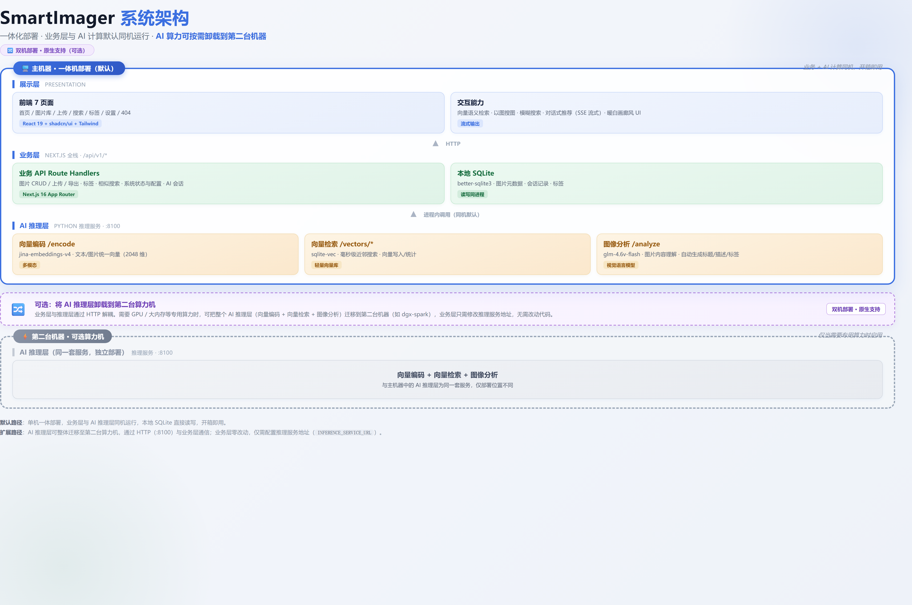

<div align="center">
  
  <h1>SmartImageFinder</h1>

  <p>智能图片搜索 / 管理与 AI 对话式推荐系统</p>

  <div>
    <a href="LICENSE"></a>
    
    
    
    
  </div>

  <div>
    <a href="README.md">中文</a> |
    <a href="README_EN.md">English</a>
  </div>
</div>

## 项目概述

SmartImageFinder 是一个现代化的智能图片搜索与管理系统，采用轻量一体化 FastAPI 后端 + React 前端架构，集成向量语义检索、以图搜图、模糊检索与对话式 AI 推荐。

## 🏗️ 系统架构

### 架构概览


当前版本采用轻量一体化后端（FastAPI）+ 前端（React）架构，AI 推荐 / 对话代理集成在 `backend/ai_func/recommendation` 中，结合 sqlite-vec 向量检索与 SSE 流式输出，无需额外独立 AI 微服务即可完成智能搜索与多轮推荐。

## 功能特性

### 🖼️ 图片管理

- **图片浏览** - 直观的网格布局和图片预览功能
- **标签系统** - 强大的多标签分类和筛选管理
- **元数据编辑** - 灵活的标题、描述和自定义标签管理
- **批量操作** - 高效的批量上传、分析和标签管理
- **拖拽上传** - 支持多文件选择和拖拽上传

### 🔍 智能搜索

- **文本搜索** - 基于自然语言描述的图片检索
- **图片搜索** - 以图搜图，查找相似内容
- **向量搜索** - 基于标题、描述和图片内容的多维度搜索
- **相似搜索** - 基于参考图片的相似性检索
- **过滤搜索** - 支持标签和时间的组合过滤
- **模糊搜索 (Fuzzy LIKE)** - 轻量关键词 LIKE 匹配，适合快速匹配式搜索

#### 💬 对话式图片搜索（Chat-driven Image Retrieval）

基于对话的多轮图片智能检索与推荐：

- **多轮上下文记忆**：支持 64K 滚动窗口对话历史，自动裁剪保留关键信息
- **智能查询改写**：对用户输入进行归一化/关键词抽取，提升向量检索命中率
- **分阶段流程**：改写 -> 多向量检索（标题/描述/图像内容）-> 结果重排序 -> 生成回复
- **SSE 流式输出**：事件包括 `rewrite_start` / `assistant_delta` / `complete` / `error`
- **会话管理**：支持创建 / 列出 / 删除会话，`conversation_id` 绑定上下文
- **结果增强**：返回图片精简信息（id/score/title/tags/public_url）+ 选中图片ID列表
- **安全控制**：向量目标白名单限制检索范围（如 `title_vector` / `desc_vector` / `image_vector`）

主要接口：

| 功能 | 方法 | 路径 |
|------|------|------|
| 创建会话 | POST | `/api/v1/ai/conversations/create` |
| 列出会话 | GET  | `/api/v1/ai/conversations` |
| 删除会话 | DELETE | `/api/v1/ai/conversations/{conversation_id}` |
| 获取会话消息 | GET | `/api/v1/ai/conversations/{conversation_id}/messages` |
| 对话式推荐（一次性） | POST | `/api/v1/ai/recommend/chat` |
| 对话式推荐（SSE流） | POST | `/api/v1/ai/recommend/chat/stream` |

请求示例（流式推荐，默认端口 8000，可在 config.yaml 调整）：

```bash
curl -N -X POST http://localhost:8000/api/v1/ai/recommend/chat/stream \
  -H "Content-Type: application/json" \
  -d '{
    "conversation_id": "demo-session-1",
    "query": "给我找一些蓝色天空下的城市建筑照片",
    "vector_targets": ["title_vector", "desc_vector", "image_vector"],
    "limit": 12
  }'
```

SSE 返回关键事件（示例）：

```text
event: rewrite_start
data: {"message":"start","conversation_id":"demo-session-1"}

event: assistant_delta
data: {"delta":"正在为你检索相关图片..."}

event: complete
data: {"image_ids":[12,8,5,...],"assistant_text":"已为你找到...","images_brief":[...]} 
```

前端可基于事件类型实时渲染“AI思考中 / 追加回答 / 展示图片结果”等状态，带来顺滑的交互体验。

### 🤖 AI分析功能

- **自动分析** - 基于CLIP模型的图片内容理解
- **智能标注** - 自动生成图片标题、描述和标签
- **批量处理** - 支持大规模图片的批量AI分析
- **API集成** - 支持多种多模态视觉模型API

### 🎨 用户界面

- **现代化设计** - 基于React 18 + Ant Design 5的精美界面
- **响应式布局** - 完美适配桌面端和移动端
- **实时交互** - 支持图片预览、缩放和编辑操作
- **状态监控** - 实时显示处理进度和系统状态
- **系统管理** - 完善的配置管理和监控界面

## 🎯 核心技术特点

- **🧠 对话式推荐代理** - 支持多轮上下文（64K滚动窗口）+ 工具函数调用
- **🛡️ 向量目标白名单** - 防止非法表名/注入导致的表不存在错误
- **🔌 流式SSE输出** - AI 推荐过程逐步推送（改写、搜索、结果）提升交互体验
- **⚡ 高性能向量检索** - SQLite + sqlite-vec 轻量级向量数据库，毫秒级搜索响应
- **🧠 先进的AI模型** - 集成Jina CLIP V2模型，提供精准的多模态搜索能力
- **🎨 现代化技术栈** - React 18 + TypeScript + FastAPI，确保代码质量和开发体验
- **🔧 智能启动管理** - 一键启动脚本，自动处理环境配置和依赖管理

## 🚀 快速开始

### 环境初始化

(请确保你的的电脑里面带有node和python环境)
首次使用需要初始化环境：

```bash
# 克隆项目
git clone https://github.com/li-xiu-qi/SmartImageFinder.git
cd SmartImageFinder

# 环境初始化（自动安装依赖、下载模型、生成配置）
python start.py init
```

### 启动服务

```bash
# 启动主服务（前后端）
python start.py

# 仅启动后端服务
python start.py --backend-only

# 仅启动前端服务
python start.py --frontend-only
```

启动脚本会自动：
✅ 检查环境依赖  ✅ 安装所需包  ✅ 下载AI模型  ✅ 启动服务

## 应用场景

- **个人图片管理** - 智能整理和检索个人照片库
- **设计素材管理** - 高效管理和搜索设计资源
- **内容创作** - 为创作者提供智能图片检索服务

## 🛠️ 技术架构

### 主服务技术栈

#### 后端 (`backend/`)

- **FastAPI** - 高性能异步Web框架
- **SQLite + sqlite-vec** - 轻量级向量数据库
- **Jina CLIP V2** - 多模态向量编码模型
- **连接池管理** - 高效的数据库连接管理
- **向量缓存** - diskcache实现的向量缓存系统

#### 前端 (`frontend/`)

- **React 18 + TypeScript** - 现代化前端框架
- **Ant Design 5.25** - 企业级UI组件库
- **Vite** - 快速构建工具
- **React Router 7.5** - 路由管理
- **Axios** - HTTP客户端

### AI服务技术栈

#### AI后端 (`ai_backend/`)

- **FastAPI** - AI服务API框架
- **推荐算法** - 智能图片推荐引擎
- **多模态分析** - 图片内容理解和分析

#### AI前端 (`ai_frontend/`)

- **React 18 + TypeScript** - AI交互界面
- **Ant Design 5.4** - UI组件库
- **智能搜索** - AI驱动的搜索体验

### 核心组件

- **向量搜索引擎** - 统一向量语义搜索（文本 / 图片 / 直接向量 / 相似）
- **AI分析引擎** - 自动图片内容分析和标注
- **标签管理系统** - 智能标签分类和管理
- **缓存系统** - 高性能向量缓存机制
- **配置管理** - 灵活的系统配置管理

## 🖥️ 系统要求

### 支持平台

- **Windows**: x86_64
- **Linux**: x86_64, aarch64  
- **macOS**: x86_64 (Intel), aarch64 (Apple Silicon)

## 📁 项目结构

```
SmartImageFinder/
├── backend/                       # 后端主服务（API、数据库、AI推荐等）
│   ├── routers/                   # 路由模块（images/tags/search/metadata等）
│   ├── db_func/                   # 数据库与向量相关操作
│   ├── ai_func/                   # AI分析与推荐（含 recommendation/agent.py）
│   ├── config/                    # 配置文件与驱动
│   └── global_schemas.py          # 通用响应模型
├── frontend/                      # 前端主服务（React+AntD）
│   ├── src/pages/                 # 页面组件
│   ├── src/components/            # 通用组件
│   ├── src/services/              # API服务层
│   └── public/                    # 静态资源
├── models/                        # AI模型文件（本地或下载）
├── data/                          # 数据存储
│   ├── db/                        # SQLite数据库文件
│   ├── images/                    # 图片存储
│   ├── caches/                    # 向量缓存
│   └── temp/                      # 临时文件
├── scripts/                       # 启动与环境管理脚本
├── docs/                          # 架构图与API文档
├── requirements.txt               # Python依赖
├── main.py                        # 后端主入口（API服务主文件）
├── start.py                       # 一键启动入口
└── README.md                      # 项目说明
```

## 🔧 详细配置

### 服务端口

- **后端**: 8000 (默认，可配置)
- **前端**: 5173 (Vite 默认)

### 配置文件

主要配置文件位于 `backend/config_files/config.yaml`：

```yaml
MODEL_PATH: ./models/yizhixiaoke/xiaoke-jina-clip-v2  # 模型路径
VECTOR_DB_DRIVER_DIR: ./backend/config_files/vector_db_driver  # 向量数据库驱动
UPLOAD_DIR: ./data/images  # 图片上传目录
DB_PATH: ./data/db/smartimagefinder.db  # 数据库路径
HOST: 0.0.0.0  # 服务监听地址
PORT: 8000  # 服务端口（默认）
```

### 💡 使用提示

#### 服务访问地址

- **主前端界面**: <http://localhost:5173>
- **主后端API**: <http://localhost:8000>  
- **API文档**: <http://localhost:8000/docs>

## 📊 系统监控与管理

### 系统状态监控

通过系统设置页面可以实时监控：

- **系统信息** - CPU、内存、磁盘使用情况
- **数据库状态** - 连接池状态、表统计信息
- **存储信息** - 图片数量、标签数量、存储使用情况
- **缓存状态** - 缓存目录大小（已简化，不再显示条目数）
- **向量数据库** - 驱动状态、索引信息

### 缓存统计说明

缓存接口 `/api/v1/system/cache` 现在仅返回目录大小 (MB)、可选 cache.db 文件大小与 last_scan；清理后前端轮询 `/api/v1/system/cache/brief` 快速确认已归零。

### 对话式推荐 SSE 事件

流式端点只发送事件：`rewrite_start`、`assistant_delta`（多次）、`complete`、`error`；内部 selection 已聚合在 complete。

## 许可证

本项目采用 [Apache License 2.0](LICENSE) 许可证。

## 联系方式

如果您在使用过程中遇到任何问题或有任何建议，欢迎联系我：

<div align="center">
  
  <p>扫描二维码关注"筱可AI研习社"公众号</p>
</div>
