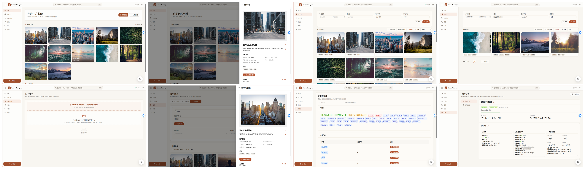
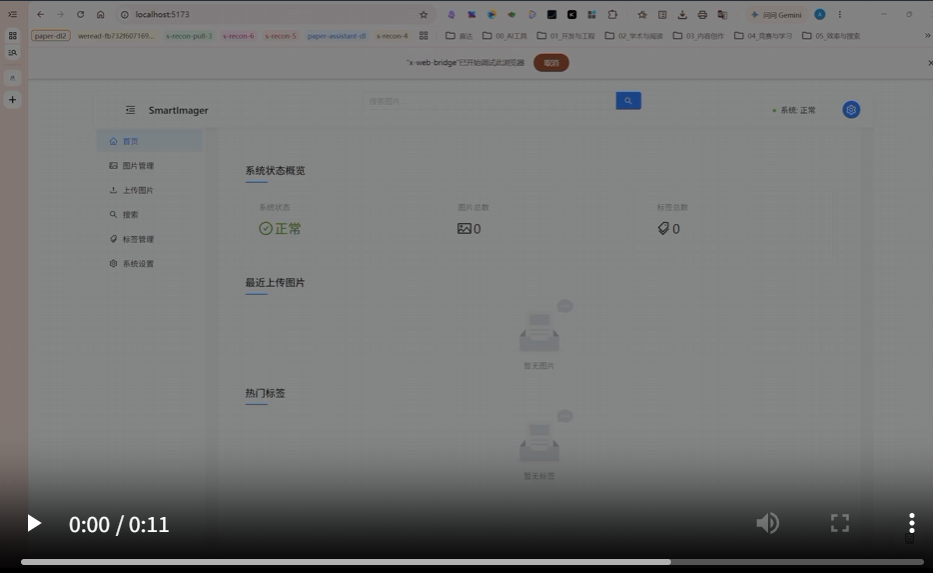
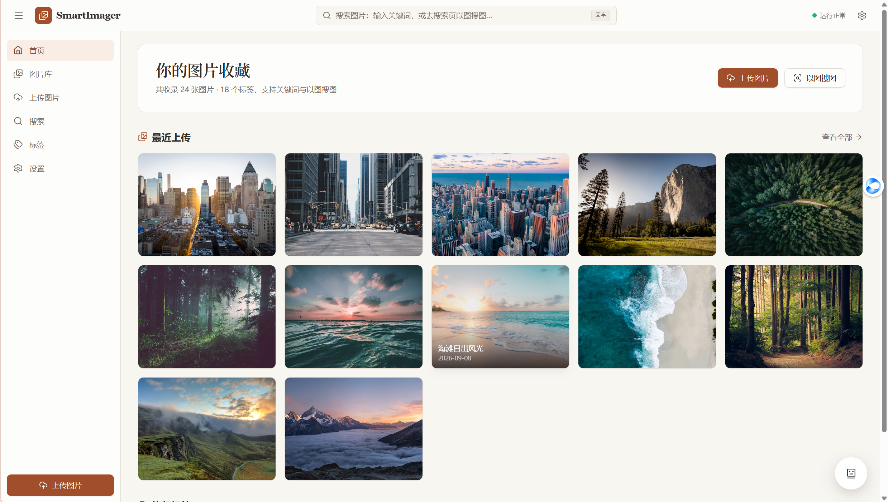
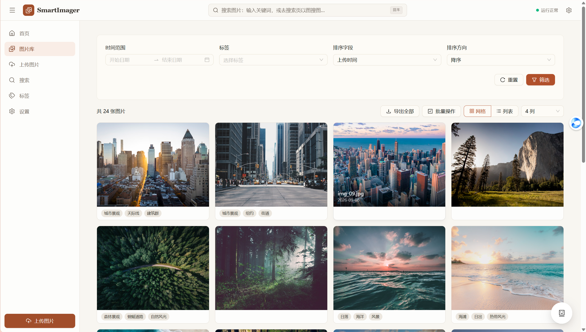
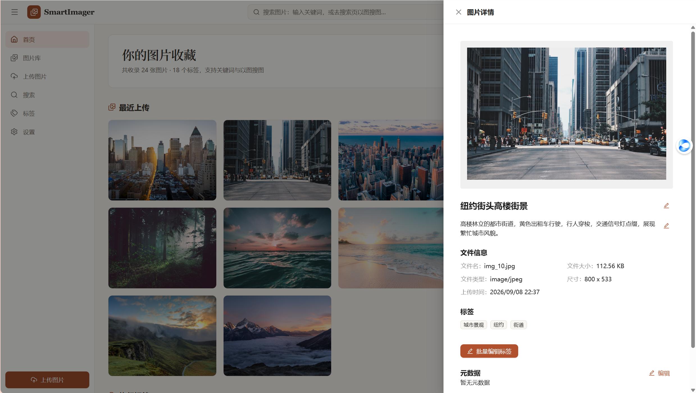
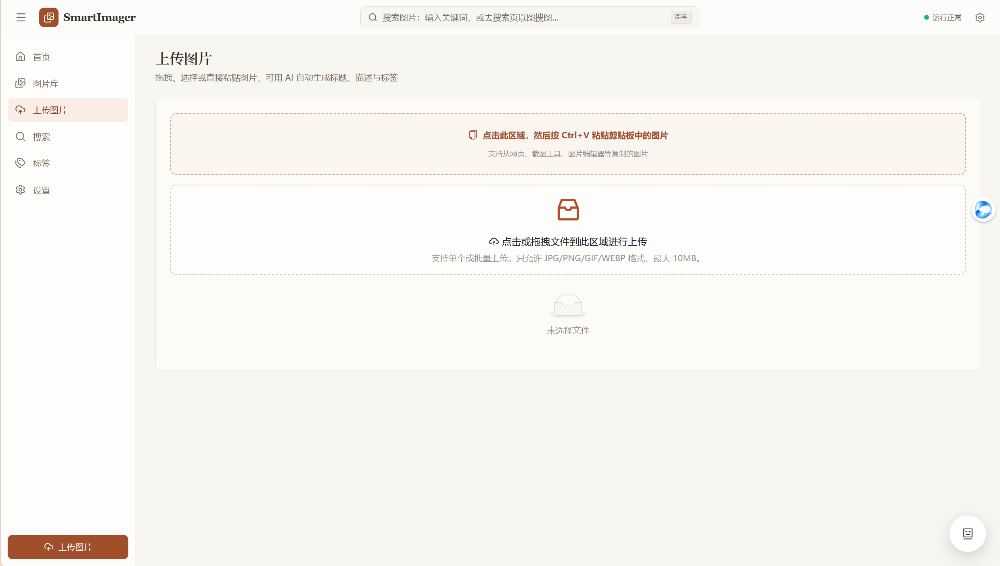
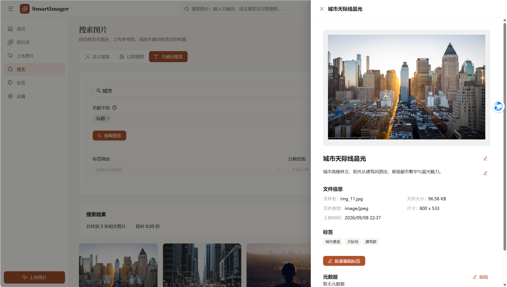
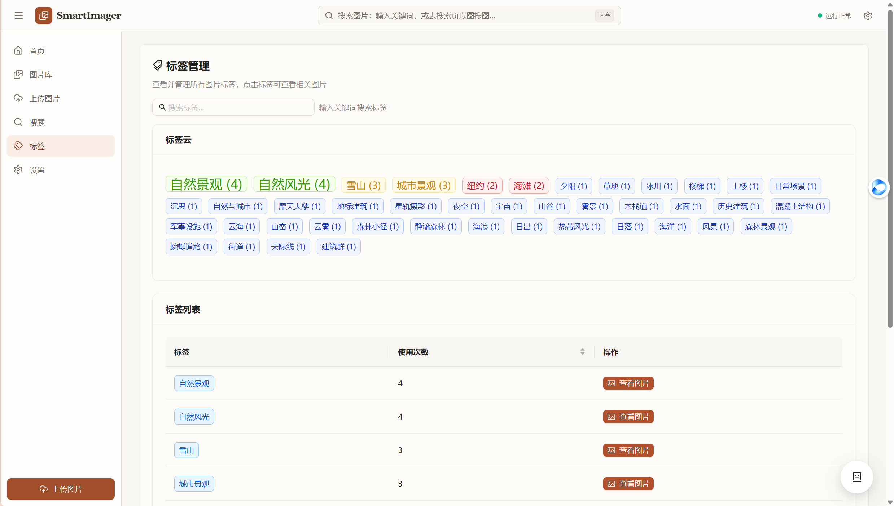

<div align="center">
  
  <h1>SmartImager</h1>

  <p>Intelligent Image Search / Management & AI Conversational Recommendation System</p>

  <div>
    <a href="LICENSE"></a>
    
    
    
  </div>

  <div>
    <a href="README.md">中文</a> |
    <a href="README_EN.md">English</a>
  </div>
</div>

## Project Overview

SmartImager is a modern intelligent image search and management system, built with a **Next.js full-stack + standalone inference service** architecture: the business layer (frontend pages, REST API, local SQLite) runs in Next.js, while vector encoding, vector retrieval, and image analysis are handled by an independent Python inference service. It features vector semantic retrieval, image-to-image search, fuzzy search, and conversational AI recommendations. The default multimodal/text-unified vector model is Jina Embeddings v4 (replacing the original Jina CLIP V2), providing higher quality semantic representations.

## 🏗️ System Architecture

### Architecture Overview


SmartImager is designed for **all-in-one deployment**: the business layer and AI computation run on the same machine by default, with local SQLite accessed directly, ready to use out of the box.

The system has four layers. The **presentation layer** is the frontend with 7 pages (home, image library, upload, search, tags, settings, 404). The **business layer** is the Next.js full-stack, where `/api/v1/*` serves as the backend API, paired with a local SQLite storing image metadata, sessions, and tags. The **AI inference layer** is the Python inference service (`:8100`), holding the jina-embeddings-v4 encoding model, the sqlite-vec vector store, and the glm vision model, providing encoding, vector retrieval, and image analysis capabilities.

Under all-in-one deployment, the business layer and AI inference layer run on the same machine, with the business layer calling the inference layer in-process. When dedicated compute such as GPU or large memory is needed, the architecture **natively supports** offloading the entire AI inference layer to a second machine (communicating over HTTP `:8100`), with no code changes to the business layer, only the inference service address needs updating.

## Features

### 🖼️ Image Management

- **Image Browsing** - Intuitive grid layout and image preview
- **Tag System** - Powerful multi-tag classification and management
- **Metadata Editing** - Flexible title, description, and custom tag management
- **Batch Operations** - Efficient batch upload, analysis, and tag management
- **Drag & Drop Upload** - Supports multi-file selection and drag-and-drop upload

### 🔍 Intelligent Search

- **Text Search** - Image retrieval based on natural language descriptions
- **Image Search** - Find similar content using image-to-image search
- **Vector Search** - Multi-dimensional search based on title, description, and image content
- **Similarity Search** - Retrieve similar images based on reference images
- **Filter Search** - Supports tag and time-based combination filtering
- **Fuzzy Search (Fuzzy LIKE)** - Lightweight keyword LIKE matching for fast search

#### 💬 Chat-driven Image Retrieval

Multi-turn conversational intelligent image retrieval and recommendation:

- **Context Memory**: Conversation history bound by `conversation_id`, messages stored in chronological order
- **Query Processing**: User input is directly encoded into a query vector for multi-path retrieval (title/desc/image content)
- **Phased Process**: Retrieval -> score aggregation -> generate reply
- **SSE Streaming Output**: Events include `rewrite_start` / `assistant_delta` / `complete` / `error`
- **Session Management**: Create/list/delete sessions, `conversation_id` binds context
- **Result Enhancement**: Returns brief image info (id/score/title/tags/public_url) + selected image ID list

Main APIs:

| Function | Method | Path |
|----------|--------|------|
| Create Session | POST | `/api/v1/ai/conversations/create` |
| List Sessions | GET  | `/api/v1/ai/conversations` |
| Delete Session | DELETE | `/api/v1/ai/conversations/{conversation_id}` |
| Get Session Messages | GET | `/api/v1/ai/conversations/{conversation_id}/messages` |
| Chat Recommendation (single) | POST | `/api/v1/ai/recommend/chat` |
| Chat Recommendation (SSE stream) | POST | `/api/v1/ai/recommend/chat/stream` |

Request Example (streaming; the Next.js full-stack defaults to `:3000`):

```bash
# Replace 3000 with the actual port printed on startup
curl -N -X POST http://localhost:3000/api/v1/ai/recommend/chat/stream \
  -H "Content-Type: application/json" \
  -d '{
    "conversation_id": "demo-session-1",
    "query": "Find me some photos of city buildings under blue sky",
    "vector_targets": ["title_vector", "desc_vector", "image_vector"],
    "limit": 12
  }'
```

SSE Key Events (example):

```text
event: rewrite_start
data: {"message":"start","conversation_id":"demo-session-1"}

event: assistant_delta
data: {"delta":"Searching for relevant images..."}

event: complete
data: {"image_ids":[12,8,5,...],"assistant_text":"Found...","images_brief":[...]} 
```

Frontend can render "AI thinking / incremental reply / show image results" in real time based on event type for smooth interaction.

### 🤖 AI Analysis Features

- **Auto Analysis** - Image content understanding based on glm-4.6v-flash vision model
- **Smart Annotation** - Auto-generate image title, description, and tags
- **Batch Processing** - Supports large-scale batch AI analysis
- **Vectorization** - Unified text/image vector encoding via jina-embeddings-v4 (2048-dim)

### 🎨 User Interface

- **Modern Design** - Warm gallery-style UI based on React 19 + shadcn/ui
- **Responsive Layout** - Perfect for desktop and mobile
- **Real-time Interaction** - Supports image preview, zoom, and editing
- **Status Monitoring** - Real-time progress and system status
- **System Management** - Complete config and monitoring interface

#### Screenshots

<table>
  <tr>
    <td align="center" width="50%"><b>Overview</b></td>
    <td align="center" width="50%"><b>Previous Version</b></td>
  </tr>
  <tr>
    <td></td>
    <td></td>
  </tr>
</table>

<table>
  <tr>
    <td align="center" width="33%"><b>Home</b></td>
    <td align="center" width="33%"><b>Image Library</b></td>
    <td align="center" width="33%"><b>Image Detail</b></td>
  </tr>
  <tr>
    <td></td>
    <td></td>
    <td></td>
  </tr>
  <tr>
    <td align="center"><b>Upload</b></td>
    <td align="center"><b>Search</b></td>
    <td align="center"><b>Tags</b></td>
  </tr>
  <tr>
    <td></td>
    <td></td>
    <td></td>
  </tr>
</table>

## 🎯 Core Technical Features

- **🧠 Conversational Recommendation Agent** - Multi-turn context (64K rolling window) + tool function calls
- **🛡️ Vector Target Whitelist** - Prevents illegal table names/injection errors
- **🔌 Streaming SSE Output** - AI recommendation process pushes rewrite/search/result for better UX
- **⚡ High-performance Vector Retrieval** - SQLite + sqlite-vec lightweight vector DB, millisecond-level search
- **🧠 Advanced AI Models** - Integrated Jina Embeddings v4 (text/image multimodal vectors), better recall and semantics than old Jina CLIP V2
- **🎨 Modern Tech Stack** - Next.js 16 + React 19 + TypeScript + shadcn/ui + Tailwind CSS for code quality and dev experience
- **🔧 Standalone Inference Service** - Vector encoding, retrieval, and image analysis deployed independently; restarts on its own without slowing the business layer
- **🔄 Offline Vector Model Migration** - Script `migrate_embeddings.py` supports breakpoint resume, auto dimension detection, atomic switch of `*_vectors` virtual tables, safe cache replacement, and auto-update of the inference service config `MODEL_PATH` and `EMBEDDING_DIMENSION` after completion.

### 🔄 Embedding Model Migration

To upgrade the current vector model (e.g., from Jina CLIP V2 to Jina Embeddings v4, or switch to any local/HuggingFace model) and regenerate image/title/desc vectors, use the root script:

```bash
python migrate_embeddings.py            # Uses default config
python migrate_embeddings.py --resume   # Resume after interruption
```

Key features:

- Auto-detect if `*_vectors_new` is needed (only if dimension changes, atomic switch after completion)
- Batch processing + `model_migrations` table records progress, supports resume
- Avoids UPSERT unsupported: uses INSERT OR IGNORE + UPDATE for sqlite-vec virtual tables
- Auto-updates the inference service config with new model path and dimension after success
- Old cache directory auto-renamed to `*_old` for rollback/cleanup

Before running: stop the inference service and backup DB files (see `docs/model_migration.md`).

> **Note**: the migration script defaults to reading `backend/config/files/migration.yaml`. The old `backend/` has been archived to `Smartlmager-suite/archive/backend-fastapi-legacy/`. Before running, use `--config` to specify an accessible config path, or copy the needed config to an accessible location.

More details, config fields, and rollback strategy: `docs/model_migration.md`.

## 🚀 Quick Start

SmartImager supports **all-in-one deployment**: the business layer (Next.js full-stack) and the AI inference layer (Python inference service) can run on the same machine, or the inference layer can be offloaded to a separate compute machine. The two parts below are started independently.

### Option 1: Next.js Full-Stack Version (current main version)

The business layer has fully migrated to Next.js. Frontend pages, REST API and the local SQLite database all live there.

```bash
# 1. Enter the Next.js app directory
cd next-app

# 2. Install dependencies (note: when NODE_ENV is production on this machine, it must be explicitly overridden, otherwise devDependencies are not installed)
NODE_ENV=development npm install

# 3. Start the dev server (--webpack is required; Turbopack hangs indefinitely while waiting for request compilation)
NODE_ENV=development npx next dev --port 3000 --webpack
```

Then visit <http://localhost:3000>.

> The inference service must be started separately (see Option 2). Otherwise AI features such as upload analysis and vector search are unavailable, and pages will show a degraded state.

### Option 2: Python Inference Service (remote, required by AI features)

The inference service owns the jina-embeddings-v4 model, the sqlite-vec vector store and the vision language model, and exposes capabilities over HTTP on `:8100`.

```bash
# The inference service can run locally or on a remote compute machine (e.g. dgx-spark)
# Environment setup, model loading, .env config, vec0.so driver adaptation, startup commands, etc.
# See docs/推理服务独立-拆分设计.md
```

The inference service exposes the following endpoints (on `:8100`):

| Function | Method | Path |
|------|------|------|
| Health check | GET | `/health` |
| Text/image encoding | POST | `/encode` |
| Vector insert | POST | `/vectors/add` |
| Vector search | POST | `/vectors/search` |
| Vector stats | GET | `/vectors/stats` |
| Image analysis | POST | `/analyze` |

### Startup Checklist

- Next.js full-stack: `curl http://localhost:3000` should return the home page HTML
- Inference service: `curl http://<inference-host>:8100/health` should return `{"status":"ok","model_loaded":true,...}`
- End to end: upload an image; auto-generated title/description/tags mean the full pipeline works

### Ports and Proxy Configuration (Important)

- **Next.js full-stack**: default `:3000`, set via `npx next dev --port`
- **Inference service**: default `:8100`, set via the inference-side env var `INFERENCE_PORT`
- **Next.js to inference service**: defaults to `http://<remote-host>:8100`; see `next-app/src/lib/inference.ts` and `next-app/.env` for the actual target
- **Vector DB and model paths**: configured in the inference-side `.env` (`VECTOR_DB_PATH`, `VECTOR_DB_DRIVER`, `MODEL_PATH`, etc.), decoupled from Next.js

## Application Scenarios

- **Personal Image Management** - Organize and retrieve personal photo library
- **Design Asset Management** - Efficiently manage and search design resources
- **Content Creation** - Provide intelligent image search for creators

## 🛠️ Technical Architecture

### Overall Topology

Two independent components communicating over HTTP:

- **Next.js full-stack (local :3000)**: frontend + business API + local SQLite
- **Python inference service (remote :8100)**: vector encoding + vector search + image analysis

### Next.js Full-Stack (`next-app/`)

- **Next.js 16 (App Router)** - frontend pages and route handlers in one repo, `/api/v1/*` serves as the backend API
- **React 19 + TypeScript** - UI and types
- **shadcn/ui + Tailwind CSS** - UI component layer and styling (warm-white gallery style)
- **better-sqlite3** - local SQLite storing image metadata, sessions and tags
- **Lucide** - icons

Frontend has 7 pages: home, image library, upload, search, tags, settings, 404.

### Python Inference Service (remote :8100)

- **jina-embeddings-v4** - unified text/image vector encoding (default 2048 dims)
- **sqlite-vec** - lightweight vector database, millisecond-level nearest-neighbor search
- **glm-4.6v-flash** - multimodal vision model for image content understanding and annotation
- **FastAPI + uvicorn** - framework of the inference service itself
- **Independently deployed** - owns models and the vector store, exposes `/encode`, `/vectors/*`, `/analyze` upward, can restart alone

### Core Capabilities

- **Vector Search Engine** - unified semantic search (text / image / direct vector / similarity)
- **AI Analysis Engine** - automatic image content analysis and annotation (title / description / tags)
- **Tag Management System** - smart tag classification and management
- **Config Management** - the inference-side `.env` self-loads, decoupled from the business layer

## 🖥️ System Requirements

### Supported Platforms

- **Windows**: x86_64
- **Linux**: x86_64, aarch64  
- **macOS**: x86_64 (Intel), aarch64 (Apple Silicon)

## 📁 Project Structure

```
SmartImager/
├── next-app/                     # Next.js full-stack (frontend + business API + local SQLite)
│   ├── src/
│   │   ├── app/                  # Pages and routes
│   │   │   ├── page.tsx          # Home
│   │   │   ├── images/           # Image library
│   │   │   ├── upload/           # Upload
│   │   │   ├── search/           # Search
│   │   │   ├── tags/             # Tags
│   │   │   ├── settings/         # Settings
│   │   │   ├── not-found.tsx     # 404
│   │   │   └── api/v1/           # Business API route handlers
│   │   │       ├── images/       #   Image CRUD / upload / export / file serving
│   │   │       ├── tags/         #   Tags
│   │   │       ├── search/       #   Similarity search
│   │   │       ├── system/       #   System status / config
│   │   │       └── ai/           #   Sessions + conversational recommendation (SSE)
│   │   ├── components/           # UI components (layout / ui / ai / GalleryImageCard, etc.)
│   │   ├── lib/                  # db.ts (better-sqlite3), inference.ts (inference client)
│   │   └── services/             # api.ts, chatService.ts, searchClient.ts
│   ├── data/                     # Local SQLite (smartimager.db) and uploaded images
│   ├── next.config.js            # serverExternalPackages + API proxy rewrites
│   ├── tailwind.config.cjs       # Tailwind config (CommonJS, because package.json is ES module)
│   ├── MIGRATION-NOTES.md        # Migration schema and status records
│   └── package.json              # Next.js 16 + React 19 + TypeScript
├── assets/                       # Static assets such as logos
├── docs/                         # Architecture diagram, screenshots, design docs
│   ├── 架构图.png / 架构图.html   #   System architecture diagram (source is HTML, renderable in browser)
│   ├── screenshots/              # UI screenshots
│   └── 推理服务独立-拆分设计.md    #   Inference service split design
├── main.py                       # Legacy all-in-one backend entry (archived, kept for compatibility)
├── start.py                      # Legacy one-click startup script (archived, kept for compatibility)
├── migrate_embeddings.py         # Offline vector model migration script (resumable)
├── scripts/                      # Environment & startup helper scripts
├── templates/                    # Template files
├── requirements.txt              # Python dependencies (inference service / migration scripts)
└── README.md                     # Project description
```

> The legacy `frontend/` (React + Ant Design) and `backend/` (FastAPI) have been moved out of this repo and archived to the sibling `Smartlmager-suite/archive/`. Retrieve from there when needed.

## 🔧 Detailed Configuration

### Service Ports

- **Next.js full-stack**: `3000` (default), set via `npx next dev --port`
- **Python inference service**: `8100` (default), set via the env var `INFERENCE_PORT`

### Key Configuration

**Next.js side** (`next-app/.env` or env vars):

| Variable | Default | Description |
|------|--------|------|
| `INFERENCE_SERVICE_URL` | `http://192.168.1.170:8100` | Inference service address |
| `DB_PATH` | `next-app/data/smartimager.db` | Local SQLite path |

**Inference service side** (`inference_service/.env`, self-loaded):

| Variable | Description |
|------|------|
| `MODEL_PATH` | jina-embeddings-v4 model snapshot path |
| `VECTOR_DB_DRIVER` | sqlite-vec `vec0.so` driver path |
| `GLM_API_KEY` | Zhipu API key (glm-4.6v-flash vision / glm-4.7-flash text) |
| `OPENAI_API_BASE` | Zhipu OpenAI-compatible endpoint |
| `VISION_MODEL` / `CHAT_MODEL` | Vision / text model names |

> `VECTOR_DB_PATH` (vector DB file path) and `INFERENCE_PORT` are passed as env vars at startup and are not written to `.env`.

### 💡 Usage Tips

#### Service Access

- **Main frontend UI**: <http://localhost:3000>
- **Inference service health check**: <http://localhost:8100/health>

## 📊 System Monitoring & Management

### System Status Monitoring

The settings page shows real-time status:

- **System Info** - CPU, memory, disk usage
- **DB Status** - connection pool status, table statistics
- **Storage Info** - image count, tag count, storage usage
- **Vector DB** - driver status, index info

### Conversational Recommendation SSE Events

The streaming endpoint only sends events: `rewrite_start`, `assistant_delta` (multiple), `complete`, `error`; the final image results are aggregated in `complete`.
## Contact

If you have any questions or suggestions, feel free to contact me:

<div align="center">
  
  <p>Scan the QR code to follow "XiaoKe AI Study Club" WeChat Official Account</p>
</div>
