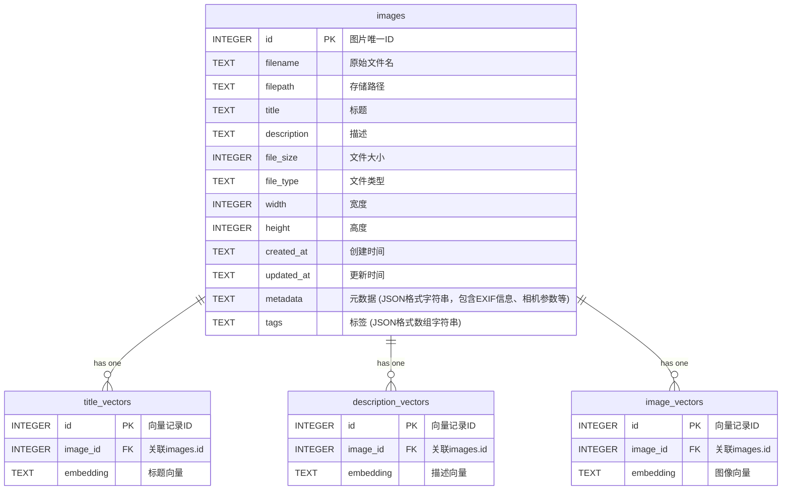

# 数据库设计文档

本文档详细描述了 SmartImageFinder 项目的数据库结构、连接方式以及相关的设计考量。

## 一、数据库表结构

数据库采用 SQLite，并利用 `sqlite-vec` 扩展来支持向量搜索功能。

### 1. `images` 表

该表是核心表，用于存储图片的基本信息和元数据。

| 字段名        | 类型                          | 约束                | 描述                                       |
|---------------|-------------------------------|---------------------|--------------------------------------------|
| `id`          | INTEGER                       | PRIMARY KEY, AUTOINCREMENT | 图片的唯一标识符                           |
| `filename`    | TEXT                          | NOT NULL            | 图片的原始文件名                           |
| `filepath`    | TEXT                          | NOT NULL            | 图片在服务器上的存储路径                   |
| `title`       | TEXT                          |                     | 图片的标题                                 |
| `description` | TEXT                          |                     | 图片的描述信息                             |
| `file_size`   | INTEGER                       | NOT NULL            | 文件大小（字节）                           |
| `file_type`   | TEXT                          | NOT NULL            | 文件类型 (例如, 'image/jpeg', 'image/png') |
| `width`       | INTEGER                       |                     | 图片宽度（像素）                           |
| `height`      | INTEGER                       |                     | 图片高度（像素）                           |
| `created_at`  | TEXT                          | NOT NULL            | 图片记录的创建时间                         |
| `updated_at`  | TEXT                          | NOT NULL            | 图片记录的最后更新时间                     |
| `metadata`    | TEXT                          |                     | 存储额外的元数据 (JSON格式字符串，包含EXIF信息、相机参数等) |
| `tags`        | TEXT                          |                     | 图片的标签 (JSON格式数组字符串) |

**索引**:

* `idx_images_created_at`: 在 `created_at` 字段上创建，用于加速按创建时间排序和查询。

### 2. 向量表

这些表是使用 `sqlite-vec` 扩展创建的虚拟表，用于存储从图片标题、描述和图片内容本身提取的特征向量，以支持语义搜索。

* **向量维度 (`embedding_dim`)**: 由 `backend.utils.generate_vector.get_embedding_dimension()` 函数动态获取，实际使用Jina CLIP V2模型为1024维。
* **距离度量 (`DISTANCE_METRIC`)**: `cosine` (余弦相似度)，适用于比较文本或图像特征向量。

#### a. `title_vectors` 表

存储图片标题的特征向量。

| 字段名      | 类型                          | 约束                               | 描述                                     |
|-------------|-------------------------------|------------------------------------|------------------------------------------|
| `id`        | INTEGER                       | PRIMARY KEY, AUTOINCREMENT         | 向量记录的唯一标识                       |
| `image_id`  | INTEGER                       | UNIQUE, NOT NULL                   | 关联到 `images` 表的 `id`                |
| `embedding` | FLOAT[1024]                   |                                    | 存储标题文本的特征向量 (1024维)          |

#### b. `description_vectors` 表

存储图片描述的特征向量。

| 字段名      | 类型                          | 约束                               | 描述                                     |
|-------------|-------------------------------|------------------------------------|------------------------------------------|
| `id`        | INTEGER                       | PRIMARY KEY, AUTOINCREMENT         | 向量记录的唯一标识                       |
| `image_id`  | INTEGER                       | UNIQUE, NOT NULL                   | 关联到 `images` 表的 `id`                |
| `embedding` | FLOAT[1024]                   |                                    | 存储描述文本的特征向量 (1024维)          |

#### c. `image_vectors` 表

存储图片内容本身的特征向量。

| 字段名      | 类型                          | 约束                               | 描述                                     |
|-------------|-------------------------------|------------------------------------|------------------------------------------|
| `id`        | INTEGER                       | PRIMARY KEY, AUTOINCREMENT         | 向量记录的唯一标识                       |
| `image_id`  | INTEGER                       | UNIQUE, NOT NULL                   | 关联到 `images` 表的 `id`                |
| `embedding` | FLOAT[1024]                   |                                    | 存储图片内容的特征向量 (1024维)          |

### 3. 表关系图 (ERD)

```mermaid
erDiagram
    images {
        INTEGER id PK "图片唯一ID"
        TEXT filename "原始文件名"
        TEXT filepath "存储路径"
        TEXT title "标题"
        TEXT description "描述"
        INTEGER file_size "文件大小"
        TEXT file_type "文件类型"
        INTEGER width "宽度"
        INTEGER height "高度"
        TEXT created_at "创建时间"
        TEXT updated_at "更新时间"
        TEXT metadata "元数据 (JSON格式字符串，包含EXIF信息、相机参数等)"
        TEXT tags "标签 (JSON格式数组字符串)"
    }

    title_vectors {
        INTEGER id PK "向量记录ID"
        INTEGER image_id FK "关联images.id"
        TEXT embedding "标题向量"
    }

    description_vectors {
        INTEGER id PK "向量记录ID"
        INTEGER image_id FK "关联images.id"
        TEXT embedding "描述向量"
    }

    image_vectors {
        INTEGER id PK "向量记录ID"
        INTEGER image_id FK "关联images.id"
        TEXT embedding "图像向量"
    }

    images ||--o{ title_vectors : "has one"
    images ||--o{ description_vectors : "has one"
    images ||--o{ image_vectors : "has one"
```

## 二、数据库连接方式

项目采用了两种主要的数据库连接方式，均基于 SQLite：

### 1. 单连接模式

* **实现**: `backend.db_func.core.get_db_connection`
* **机制**: 直接使用 `sqlite3.connect(DB_PATH, check_same_thread=False)` 创建连接。
  * `check_same_thread=False`: 允许在多线程环境中使用同一连接对象，但要求应用代码自行确保线程安全。
* **管理**: 通过 Python 的上下文管理器 (`@contextmanager`) 确保连接在使用完毕后正确关闭。
* **用途**: 主要用于数据库初始化 (`init_db`) 或在连接池不可用时的备选方案。

### 2. 连接池模式

* **实现**: `backend.db_func.connection_pool.get_db_connection_from_pool`
* **目的**: 提高高并发场景下的性能和资源利用率，通过复用连接避免频繁创建和关闭连接的开销。
* **工作方式**:
  * 使用线程安全的队列管理连接池。
  * 请求连接时，从池中获取；若池空则创建新连接；连接使用完毕后归还到池中。
* **线程安全**: 连接池使用 `queue.Queue` 实现线程安全。
* **FastAPI 集成**:
  * `backend.db_func.core.get_db` 函数作为 FastAPI 依赖项。
  * 优先从已初始化的连接池获取连接。
  * 若连接池未初始化，则回退到单连接模式。

## 三、设计原因与考量

### 1. 技术选型

* **SQLite**:
  * **优点**: 轻量级、文件型数据库，易于部署和管理，无需独立数据库服务器，适合中小型应用或原型开发。
  * **考虑**: 对于极大规模或极高并发写入的场景可能不是最佳选择，但对于本项目目标（个人或小团队的智能图片管理）是合适的。
* **`sqlite-vec` 扩展**:
  * **优点**: 使 SQLite 能够原生支持高效的向量存储和相似度搜索，避免了引入和维护更复杂的专用向量数据库（如 Faiss, Milvus, Weaviate 等）的成本和复杂性。
  * **考虑**: 这是一个相对较新的扩展，社区和生态可能不如成熟的向量数据库完善，但其提供的功能对于本项目已足够。

### 2. 表结构设计

* **`images` 表的规范化**:
  * 将图片的基本属性和元数据（如 EXIF、用户自定义标签）集中存储，便于进行常规的属性查询、筛选和排序。
* **分离向量表**:
  * 将不同来源（标题、描述、图像内容）的向量存储在各自的表中，并通过 `image_id` 与 `images` 表进行一对一关联。
  * **查询效率**: 允许针对特定类型的向量进行更精确和可能更快的搜索。例如，用户可能只想基于图片标题进行语义搜索。
  * **逻辑清晰**: 结构上更清晰，易于理解和维护不同类型向量数据的生成和使用逻辑。
  * **灵活性**: 未来如果需要对不同类型的向量采用不同的嵌入模型、更新策略或索引参数，分表设计提供了更大的灵活性。例如，图像内容的向量可能比文本描述的向量更新得更频繁或使用不同的模型。
* **使用 `image_id` 作为外键和唯一约束**:
  * 确保了向量数据与图片信息的一一对应关系和数据完整性。
* **索引**:
  * 在 `images.created_at` 上创建索引是为了优化按时间筛选或排序图片的常见查询场景，提高用户体验。

### 3. 连接方式设计

* **连接池**:
  * **性能**: 在 Web 应用（如本项目基于 FastAPI 的后端）中，并发用户请求是常态。连接池通过复用已建立的数据库连接，显著减少了连接建立和断开的系统开销和延迟，从而提升应用的整体响应速度和吞吐量。
  * **资源控制**: 通过设置最大连接数，可以防止应用因过多的并发请求而耗尽数据库连接资源，保证系统的稳定性和可靠性。
* **FastAPI 依赖注入 (`get_db`)**:
  * **代码简洁与可维护性**: FastAPI 的依赖注入系统使得在路由处理函数中获取和管理数据库连接变得非常简单和标准化，减少了样板代码，提高了代码的可读性和可维护性。
  * **生命周期管理**: 确保每个 HTTP 请求都能获得一个独立的数据库会话（通过从池中获取连接），并在请求处理完成后自动将连接释放回池中，有效防止了连接泄漏。
* **单连接作为备选**:
  * 提供了在连接池不适用或未初始化时的基本数据库连接能力。这对于执行一次性脚本（如数据库初始化 `init_db`）、单元测试或简单的命令行工具非常有用。
* **`check_same_thread=False` (SQLite 特定)**:
  * SQLite 默认情况下不允许在不同的线程中共享同一个连接对象。设置此参数是为了在单连接模式下提供灵活性。
  * **重要**: 连接池实现使用独立的连接来确保线程安全，每个线程从池中获取自己的连接，并在使用完毕后归还，从根本上避免 SQLite 连接的线程安全问题。

