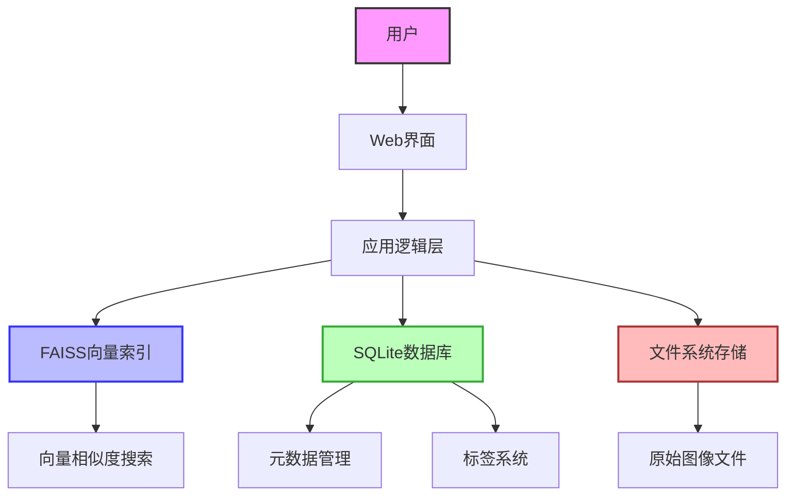
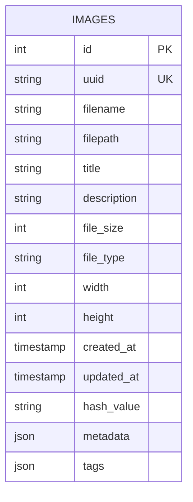
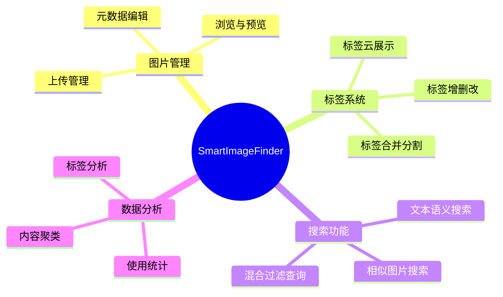

# SmartImageFinder 数据库设计

## 数据库概述

SmartImageFinder 系统采用混合数据存储架构：

- 使用 FAISS (Facebook AI Similarity Search) CPU版本进行高效的向量相似度检索
- 采用 SQLite 关系型数据库管理图片元数据和标签系统
- 文件系统存储原始图像文件

这种混合架构提供了灵活性和高性能，同时保持了系统的轻量化特性，便于部署和维护。

### 系统架构图



## 数据库架构

### 存储组件

1. **FAISS 向量索引**
   - 存储图像和文本的特征向量
   - 提供高效的近似最近邻搜索功能

2. **SQLite 关系型数据库**
   - 存储图像元数据
   - 管理标签系统
   - 支持结构化查询

3. **文件系统**
   - 存储原始图像文件
   - 采用基于日期的目录结构

### 数据模型

#### 实体关系图



#### SQLite 表结构

```
表: images
- id (整数, 自增主键)
- uuid (字符串, 唯一)
- filename (字符串)
- filepath (字符串)
- title (字符串)
- description (字符串)
- file_size (整数)
- file_type (字符串)
- width (整数)
- height (整数)
- created_at (时间戳)
- updated_at (时间戳)
- hash_value (字符串)
- metadata (JSON字符串)
- tags (JSON字符串) - 存储标签列表，如 ["自然", "风景", "山水"]
```

#### FAISS 向量索引

```
索引: title_vectors
- 维度: 1024
- 索引类型: IndexFlatIP (暴力索引)
- 度量: 内积相似度

索引: description_vectors
- 维度: 1024
- 索引类型: IndexFlatIP (暴力索引)
- 度量: 内积相似度

索引: image_vectors
- 维度: 1024
- 索引类型: IndexFlatIP (暴力索引)
- 度量: 内积相似度
```

## 字段设计详情

### images 表字段说明

1. **核心标识字段**:
    - `id`: 数据库内部主键，自增整数
    - `uuid`: 图片全局唯一标识符，用于文件系统存储和外部引用
    - `hash_value`: 图片内容哈希值，用于重复检测和缓存键值

2. **文件信息字段**:
    - `filename`: 原始文件名，保留用户上传时的文件名用于显示和下载
    - `filepath`: 图片在系统存储中的相对路径，如 "images/2023/05/[uuid].jpg"
    - `file_size`: 文件大小(字节)
    - `file_type`: 文件类型(扩展名)，如jpg、png等
    - `width`: 图片宽度(像素)
    - `height`: 图片高度(像素)

3. **描述性字段**:
    - `title`: 图片标题，可由AI自动生成或用户手动编辑
    - `description`: 图片详细描述，提供图片的内容信息
    - `metadata`: JSON对象形式的扩展元数据，如 {"拍摄地点": "北京", "相机型号": "Canon EOS R5"}
    - `tags`: JSON数组形式的标签列表，如 ["自然", "风景", "山水"]

4. **时间字段**:
    - `created_at`: 记录创建时间，默认为当前时间
    - `updated_at`: 记录最后更新时间，用于跟踪修改

5. **向量字段**:
    - `title_vector`: 图片标题的文本特征向量，由CLIP V2模型生成，维度为1024
    - `description_vector`: 图片详细描述的文本特征向量，由CLIP V2模型生成，维度为1024
    - `image_vector`: 图片视觉特征向量，由CLIP V2模型生成，维度为1024

## 标签系统设计

### JSON格式标签管理

系统将标签信息直接存储在图片记录的`tags`字段中，采用JSON数组格式：

```json
["自然", "风景", "山水", "旅行"]
```

这种设计的优势：

1. **简化数据模型**：无需维护单独的标签表和关联表
2. **减少查询复杂度**：所有信息都在一个表中，可直接检索
3. **灵活性**：标签可以随图片信息一起更新
4. **直观**：每张图片的标签直接关联，容易理解和维护

### 标签管理流程


### 热门标签查询

使用SQLite的JSON函数获取热门标签:

```python
# 获取热门标签列表
def get_popular_tags(limit=20):
    conn = sqlite3.connect('smartimagefinder.db')
    cursor = conn.cursor()
    
    # 聚合所有图片的标签并统计频率
    cursor.execute("""
        WITH RECURSIVE split_tags(tag, rest) AS (
            SELECT '', tags || ',' FROM images WHERE tags IS NOT NULL
            UNION ALL
            SELECT 
                substr(rest, 0, instr(rest, ',')),
                substr(rest, instr(rest, ',')+1)
            FROM split_tags WHERE rest != ''
        )
        SELECT tag, COUNT(*) as count
        FROM split_tags
        WHERE tag != ''
        GROUP BY tag
        ORDER BY count DESC
        LIMIT ?
    """, (limit,))
    
    results = [{"tag_name": row[0], "count": row[1]} for row in cursor.fetchall()]
    conn.close()
    
    return results
```

### 标签系统优化

1. **标签索引**:
   ```python
   # 创建标签JSON索引以加速标签搜索
   cursor.execute("""
       CREATE INDEX IF NOT EXISTS idx_image_tags ON images(tags);
   """)
   ```

2. **标签自动完成**:
   ```python
   def tag_autocomplete(prefix, limit=10):
       conn = sqlite3.connect('smartimagefinder.db')
       cursor = conn.cursor()
       
       # 使用JSON函数查找匹配前缀的标签
       cursor.execute("""
           WITH RECURSIVE split_tags(tag, rest) AS (
               SELECT '', tags || ',' FROM images WHERE tags IS NOT NULL
               UNION ALL
               SELECT 
                   substr(rest, 0, instr(rest, ',')),
                   substr(rest, instr(rest, ',')+1)
               FROM split_tags WHERE rest != ''
           )
           SELECT DISTINCT tag
           FROM split_tags
           WHERE tag LIKE ? AND tag != ''
           GROUP BY tag
           ORDER BY COUNT(*) DESC
           LIMIT ?
       """, (prefix + '%', limit))
       
       suggestions = [row[0] for row in cursor.fetchall()]
       conn.close()
       return suggestions
   ```

### 标签管理操作

直接在图片记录上管理JSON标签:

1. **添加图片标签**:

```python
def add_tags_to_image(image_uuid, new_tags):
    conn = sqlite3.connect('smartimagefinder.db')
    cursor = conn.cursor()
    
    # 获取图片当前标签
    cursor.execute("SELECT id, tags FROM images WHERE uuid = ?", (image_uuid,))
    result = cursor.fetchone()
    if not result:
        conn.close()
        return {"error": "图片不存在"}
    
    image_id, current_tags_json = result
    
    # 解析当前标签
    if current_tags_json:
        try:
            current_tags = json.loads(current_tags_json)
        except:
            current_tags = []
    else:
        current_tags = []
    
    # 添加新标签
    added_tags = []
    for tag in new_tags:
        if tag not in current_tags:
            current_tags.append(tag)
            added_tags.append(tag)
    
    # 更新图片标签
    if added_tags:
        cursor.execute("""
            UPDATE images 
            SET tags = ?, updated_at = CURRENT_TIMESTAMP
            WHERE id = ?
        """, (json.dumps(current_tags), image_id))
        conn.commit()
    
    conn.close()
    return {"status": "success", "added_tags": added_tags}
```

2. **删除图片标签**:

```python
def remove_tag_from_image(image_uuid, tag_to_remove):
    conn = sqlite3.connect('smartimagefinder.db')
    cursor = conn.cursor()
    
    # 获取图片当前标签
    cursor.execute("SELECT id, tags FROM images WHERE uuid = ?", (image_uuid,))
    result = cursor.fetchone()
    if not result:
        conn.close()
        return {"error": "图片不存在"}
    
    image_id, current_tags_json = result
    
    # 解析当前标签
    if current_tags_json:
        try:
            current_tags = json.loads(current_tags_json)
        except:
            current_tags = []
    else:
        current_tags = []
    
    # 检查标签是否存在
    if tag_to_remove not in current_tags:
        conn.close()
        return {"error": "标签不存在于该图片"}
    
    # 移除标签
    current_tags.remove(tag_to_remove)
    
    # 更新图片标签
    cursor.execute("""
        UPDATE images 
        SET tags = ?, updated_at = CURRENT_TIMESTAMP
        WHERE id = ?
    """, (json.dumps(current_tags), image_id))
    conn.commit()
    
    conn.close()
    return {"status": "success", "removed_tag": tag_to_remove}
```

### 基于标签的图片搜索

```python
def search_images_by_tag(tag_name, limit=20):
    conn = sqlite3.connect('smartimagefinder.db')
    cursor = conn.cursor()
    
    # 使用JSON函数搜索包含特定标签的图片
    cursor.execute("""
        SELECT id, uuid, title, filepath
        FROM images
        WHERE json_array_length(tags) > 0 
        AND tags LIKE ?
        LIMIT ?
    """, (f'%"{tag_name}"%', limit))
    
    results = [{"id": row[0], 
               "uuid": row[1], 
               "title": row[2], 
               "filepath": row[3]} 
               for row in cursor.fetchall()]
    
    conn.close()
    return results
```

## 与前端界面的交互

SQLite和FAISS存储方案支持前端所需的全部功能交互：

### 1. 图片浏览与管理

- **图片网格展示**：
  - 通过SQLite分页查询获取图片基本信息
  - 支持多种排序方式，如上传时间、文件名等
  - 仅加载可视区域所需数据，支持虚拟滚动

- **图片详情展示**：
  - 通过uuid查询SQLite获取完整元数据
  - 通过image_tags关联表获取图片的全部标签
  - 使用FAISS进行相似图片推荐

### 2. 标签系统交互

- **标签云展示**：
  - 直接查询SQLite的tags表获取热门标签
  - 按usage_count降序排列确保最常用标签显示在前
  - 可实现按字体大小展示标签重要性

- **标签筛选**：
  - 使用SQL JOIN查询筛选包含特定标签的图片
  - 支持多标签组合查询，实现复杂过滤逻辑

- **标签管理**：
  - 提供图片详情页的标签增删改功能
  - 支持标签合并、拆分和批量操作
  - 提供全局标签管理界面

### 3. 搜索功能

- **混合查询界面**：
  - 支持向量相似度搜索与元数据条件过滤相结合
  - 提供直观的查询构建器，帮助用户创建复杂查询条件

- **动态元数据字段发现**：
  - 分析 `metadata` JSON字段，自动发现常用的元数据键
  - 为发现的键构建专用过滤控件

- **搜索结果优化**：
  - 结果分页展示，支持无限滚动加载
  - 相似度分数可视化，帮助用户理解搜索结果匹配程度

### 功能架构图



通过这些交互模式，系统提供了直观高效的用户体验，同时充分利用了FAISS和SQLite的强大功能。
