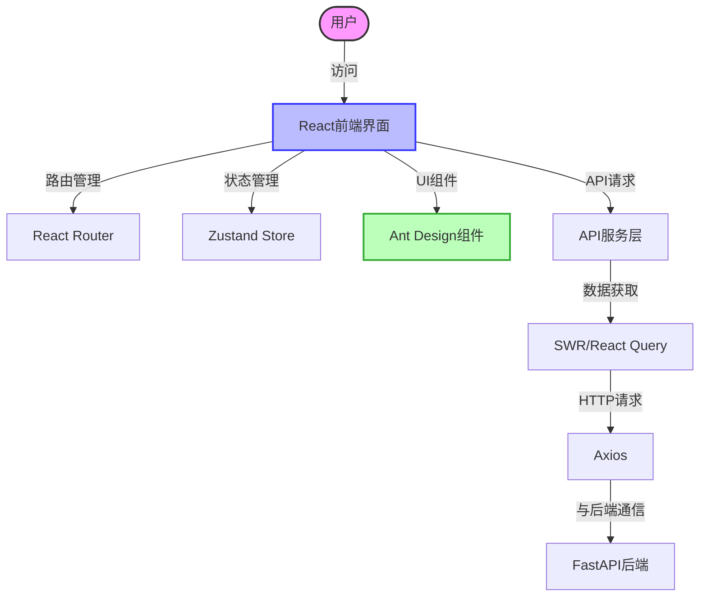
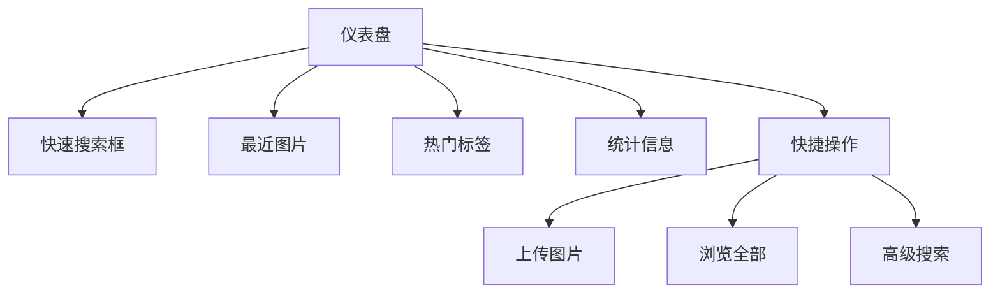
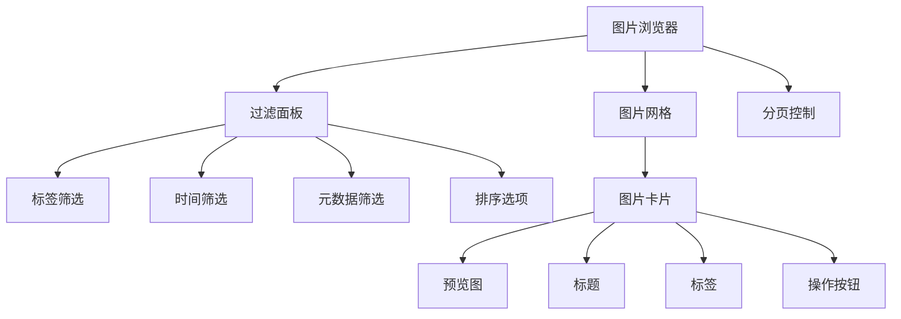
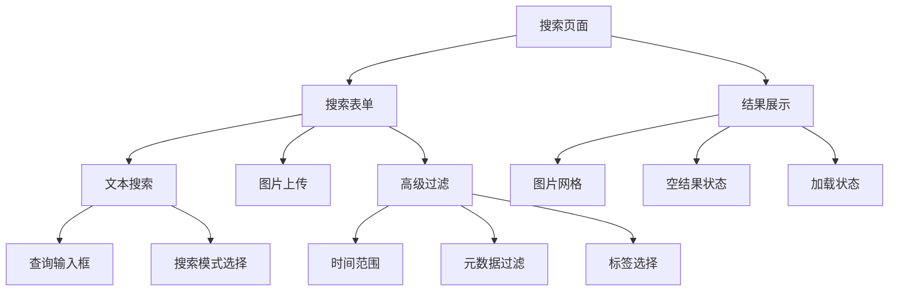
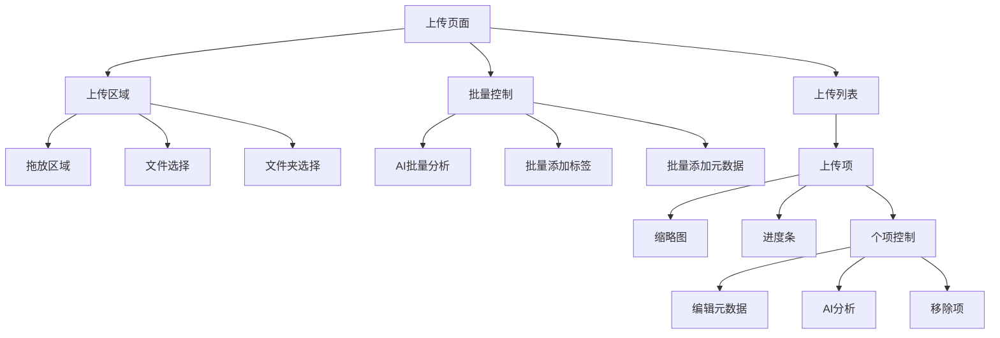

# SmartImageFinder 前端设计与实现

## 前端架构概述

SmartImageFinder 的前端采用现代化的 React + Ant Design 技术栈，为用户提供直观、响应式的界面体验。作为本地桌面 Web 应用，前端设计注重功能完整性和用户友好性，同时充分利用 Ant Design 组件库提供的交互能力。

### 技术栈选择

- **React 18**: 核心前端库，利用函数式组件和 Hooks 实现响应式 UI
- **Ant Design 5.x**: UI 组件库，提供丰富的预设组件
- **React Router 6**: 前端路由管理
- **SWR/React Query**: 数据获取和缓存
- **Zustand**: 轻量级状态管理库，替代 Redux 的简化方案
- **Vite**: 现代化构建工具，提供快速的开发体验

### 前端架构图



## 目录结构设计

为确保代码的可维护性和扩展性，前端采用功能模块化的目录结构：

```
src/
├── assets/               # 静态资源(图标、公共图片等)
├── components/           # 可复用组件
│   ├── common/           # 通用组件(Header, Footer等)
│   ├── image/            # 图片相关组件
│   ├── search/           # 搜索相关组件
│   ├── tags/             # 标签相关组件
│   └── upload/           # 上传相关组件
├── hooks/                # 自定义React Hooks
├── layouts/              # 布局组件
├── pages/                # 页面组件
│   ├── Dashboard/        # 仪表盘/首页
│   ├── ImageBrowser/     # 图片浏览器页面
│   ├── ImageDetail/      # 图片详情页面
│   ├── Search/           # 搜索结果页面
│   ├── Upload/           # 上传页面
│   └── Settings/         # 设置页面
├── services/             # API服务
│   ├── api.js            # API调用函数
│   └── endpoints.js      # API端点配置
├── store/                # 状态管理
│   ├── imageStore.js     # 图片相关状态
│   ├── searchStore.js    # 搜索相关状态
│   ├── tagStore.js       # 标签相关状态
│   └── uploadStore.js    # 上传相关状态
├── styles/               # 全局样式
├── utils/                # 工具函数
├── App.jsx               # 应用入口组件
├── main.jsx              # 应用渲染入口
└── routes.jsx            # 路由配置
```

## 主要页面设计

### 1. 仪表盘/首页 (Dashboard)

仪表盘作为应用入口，提供快速访问各功能区域的界面。



#### 实现细节

- 使用 Ant Design 的 `Statistic`, `Card`, `Row`, `Col` 组件构建布局
- 最近图片区使用 `Image.PreviewGroup` 展示最近添加/查看的图片
- 热门标签使用 `Tag` 组件以标签云形式展示，点击可直接筛选
- 快捷搜索框支持文本搜索和以图搜图，使用 `Input.Search` 和图片上传按钮
- 统计信息展示总图片数、总标签数、文件占用空间等

### 2. 图片浏览器 (ImageBrowser)

图片浏览器是系统的核心页面，提供强大的图片管理和查看功能。



#### 图片网格布局设计

使用 Ant Design 的 `List` 组件结合 `Card` 组件实现网格布局：

```jsx
// ImageGrid 组件实现概要
const ImageGrid = ({ images, loading }) => {
  return (
    <List
      grid={{ gutter: 16, xs: 1, sm: 2, md: 3, lg: 4, xl: 6, xxl: 8 }}
      dataSource={images}
      loading={loading}
      renderItem={(image) => (
        <List.Item key={image.uuid}>
          <Card
            hoverable
            cover={
              <Image
                alt={image.title}
                src={`/api/images/file/${image.uuid}`}
                placeholder={true}
                loading="lazy"
              />
            }
            actions={[
              <EditOutlined key="edit" onClick={() => handleEdit(image)} />,
              <EyeOutlined key="view" onClick={() => handleView(image)} />,
              <SearchOutlined key="search" onClick={() => handleSearchSimilar(image)} />,
              <DeleteOutlined key="delete" onClick={() => handleDelete(image)} />
            ]}
          >
            <Card.Meta 
              title={image.title} 
              description={
                <Space size={[0, 4]} wrap>
                  {image.tags?.map(tag => (
                    <Tag key={tag}>{tag}</Tag>
                  ))}
                </Space>
              } 
            />
          </Card>
        </List.Item>
      )}
    />
  );
};
```

#### 虚拟滚动优化

为优化大量图片加载性能，可以集成 `react-virtualized` 或 `react-window` 实现虚拟滚动：

```jsx
// 使用 react-virtualized 实现虚拟滚动的 ImageGrid
import { List as VirtualList, AutoSizer } from 'react-virtualized';

const VirtualizedImageGrid = ({ images, loading }) => {
  const rowRenderer = ({ key, index, style }) => {
    const image = images[index];
    return (
      <div key={key} style={style}>
        <Card
          hoverable
          style={{ margin: '8px' }}
          cover={
            <Image
              alt={image.title}
              src={`/api/images/file/${image.uuid}`}
              placeholder={true}
            />
          }
          // ... 其他卡片属性
        >
          {/* ... 卡片内容 */}
        </Card>
      </div>
    );
  };

  return (
    <div style={{ height: 'calc(100vh - 200px)' }}>
      <AutoSizer>
        {({ height, width }) => (
          <VirtualList
            height={height}
            width={width}
            rowCount={images.length}
            rowHeight={300} // 估计每行高度
            rowRenderer={rowRenderer}
          />
        )}
      </AutoSizer>
    </div>
  );
};
```

#### 交互式标签筛选实现

标签筛选功能通过组合 Ant Design 的 `Tag` 组件实现：

```jsx
// TagFilter 组件实现概要
const TagFilter = ({ allTags, selectedTags, onTagSelect }) => {
  return (
    <Card title="标签筛选" size="small">
      <div style={{ maxHeight: '300px', overflowY: 'auto' }}>
        {allTags.map(tag => (
          <Tag.CheckableTag
            key={tag.tag_name}
            checked={selectedTags.includes(tag.tag_name)}
            onChange={checked => onTagSelect(tag.tag_name, checked)}
            style={{ marginBottom: '8px' }}
          >
            {tag.tag_name} ({tag.count})
          </Tag.CheckableTag>
        ))}
      </div>
      {selectedTags.length > 0 && (
        <Button size="small" onClick={() => onTagSelect(null, false)}>
          清除筛选
        </Button>
      )}
    </Card>
  );
};
```

### 3. 搜索页面 (Search)

搜索页面提供高级搜索功能，支持多种检索模式和条件组合。



#### 搜索表单设计

整合标准搜索和向量搜索功能，提供统一的搜索界面：

```jsx
// SearchForm 组件实现概要
const SearchForm = ({ onSearch }) => {
  const [form] = Form.useForm();
  const [searchMode, setSearchMode] = useState('text'); // 'text', 'image', 'advanced'
  
  return (
    <Form form={form} onFinish={onSearch}>
      <Row gutter={16}>
        <Col span={16}>
          <Form.Item name="query">
            {searchMode === 'text' ? (
              <Input.Search 
                placeholder="输入搜索内容..." 
                allowClear 
                enterButton 
                size="large" 
              />
            ) : (
              <Upload.Dragger 
                name="searchImage"
                multiple={false}
                showUploadList={true}
                beforeUpload={() => false}
                maxCount={1}
              >
                <p className="ant-upload-drag-icon">
                  <InboxOutlined />
                </p>
                <p className="ant-upload-text">
                  点击或拖拽图片到此区域进行相似图像搜索
                </p>
              </Upload.Dragger>
            )}
          </Form.Item>
        </Col>
        <Col span={8}>
          <Radio.Group 
            value={searchMode} 
            onChange={e => setSearchMode(e.target.value)}
            buttonStyle="solid"
          >
            <Radio.Button value="text">文本搜索</Radio.Button>
            <Radio.Button value="image">图片搜索</Radio.Button>
          </Radio.Group>
        </Col>
      </Row>
      
      {/* 高级搜索选项 */}
      <Collapse ghost>
        <Collapse.Panel header="高级选项" key="advanced">
          <Row gutter={16}>
            <Col span={12}>
              <Form.Item label="时间范围" name="timeRange">
                <DatePicker.RangePicker />
              </Form.Item>
            </Col>
            <Col span={12}>
              <Form.Item label="标签" name="tags">
                <Select mode="multiple" placeholder="选择标签">
                  {/* 标签选项 */}
                </Select>
              </Form.Item>
            </Col>
          </Row>
          {/* 更多高级选项 */}
        </Collapse.Panel>
      </Collapse>
    </Form>
  );
};
```

### 4. 上传页面 (Upload)

上传页面提供多种上传方式和批量处理图片的功能。



#### 上传组件实现

利用 Ant Design 的 `Upload` 组件实现拖拽上传功能：

```jsx
// UploadPage 组件实现概要
const UploadPage = () => {
  const [fileList, setFileList] = useState([]);
  const [uploading, setUploading] = useState(false);
  const [batchMetadata, setBatchMetadata] = useState({});
  
  const handleUpload = async () => {
    setUploading(true);
    // 实现上传逻辑
    // ...
    setUploading(false);
  };
  
  return (
    <div className="upload-container">
      <Card title="图片上传">
        <Upload.Dragger
          multiple={true}
          fileList={fileList}
          beforeUpload={(file) => {
            // 添加到文件列表但不立即上传
            setFileList(prev => [...prev, { file, status: 'ready' }]);
            return false;
          }}
          onRemove={(file) => {
            const index = fileList.indexOf(file);
            const newFileList = fileList.slice();
            newFileList.splice(index, 1);
            setFileList(newFileList);
          }}
        >
          <p className="ant-upload-drag-icon">
            <InboxOutlined />
          </p>
          <p className="ant-upload-text">点击或拖拽文件到这里上传</p>
          <p className="ant-upload-hint">
            支持单个或批量上传图片文件
          </p>
        </Upload.Dragger>
        
        <div style={{ marginTop: 16 }}>
          <Button
            type="primary"
            onClick={handleUpload}
            disabled={fileList.length === 0}
            loading={uploading}
            style={{ marginRight: 8 }}
          >
            {uploading ? '上传中...' : '开始上传'}
          </Button>
          <Button
            onClick={() => setFileList([])}
            disabled={fileList.length === 0 || uploading}
          >
            清除
          </Button>
        </div>
      </Card>
      
      {/* 批量元数据编辑 */}
      <Card title="批量设置" style={{ marginTop: 16 }}>
        <Form layout="vertical">
          <Form.Item label="批量添加标签">
            <Select mode="tags" style={{ width: '100%' }} placeholder="输入标签">
              {/* 标签选项 */}
            </Select>
          </Form.Item>
          
          {/* 其他批量元数据设置 */}
          
        </Form>
        
        <Button type="primary" icon={<RobotOutlined />}>
          AI批量分析
        </Button>
      </Card>
      
      {/* 上传文件预览列表 */}
      <Card title="上传队列" style={{ marginTop: 16 }}>
        <List
          itemLayout="horizontal"
          dataSource={fileList}
          renderItem={(item, index) => (
            <List.Item
              actions={[
                <Button icon={<EditOutlined />} size="small">编辑</Button>,
                <Button icon={<RobotOutlined />} size="small">AI分析</Button>
              ]}
            >
              <List.Item.Meta
                avatar={
                  <Avatar src={URL.createObjectURL(item.file)} shape="square" size={64} />
                }
                title={item.file.name}
                description={`${Math.round(item.file.size / 1024)} KB`}
              />
              {item.status === 'uploading' && <Progress percent={item.percent} />}
            </List.Item>
          )}
        />
      </Card>
    </div>
  );
};
```

## 图片详情查看设计

### 图片详情对话框

```jsx
// ImageDetailDialog 组件实现概要
const ImageDetailDialog = ({ visible, image, onClose, onEdit, onDelete }) => {
  const [activeTab, setActiveTab] = useState('info');
  
  return (
    <Modal
      visible={visible}
      title={image?.title || '图片详情'}
      width={1000}
      footer={null}
      onCancel={onClose}
    >
      <Row gutter={16}>
        <Col span={16}>
          <Image
            src={`/api/images/file/${image?.uuid}`}
            alt={image?.title}
            style={{ width: '100%' }}
            placeholder={true}
          />
        </Col>
        <Col span={8}>
          <Tabs activeKey={activeTab} onChange={setActiveTab}>
            <Tabs.TabPane tab="基本信息" key="info">
              <Descriptions column={1}>
                <Descriptions.Item label="文件名">{image?.filename}</Descriptions.Item>
                <Descriptions.Item label="上传时间">
                  {image?.created_at && new Date(image.created_at).toLocaleString()}
                </Descriptions.Item>
                <Descriptions.Item label="文件大小">
                  {Math.round(image?.file_size / 1024)} KB
                </Descriptions.Item>
                <Descriptions.Item label="尺寸">
                  {image?.width} x {image?.height}
                </Descriptions.Item>
                <Descriptions.Item label="标签">
                  <div style={{ maxHeight: '100px', overflowY: 'auto' }}>
                    <Space size={[0, 4]} wrap>
                      {image?.tags?.map(tag => (
                        <Tag key={tag}>{tag}</Tag>
                      ))}
                    </Space>
                  </div>
                </Descriptions.Item>
              </Descriptions>
            </Tabs.TabPane>
            <Tabs.TabPane tab="元数据" key="metadata">
              <JSONView data={image?.metadata || {}} />
            </Tabs.TabPane>
            <Tabs.TabPane tab="相似图片" key="similar">
              <div style={{ height: '350px', overflowY: 'auto' }}>
                <SimilarImages imageUuid={image?.uuid} />
              </div>
            </Tabs.TabPane>
          </Tabs>
          
          <Divider />
          
          <Space>
            <Button icon={<EditOutlined />} onClick={() => onEdit(image)}>
              编辑信息
            </Button>
            <Button icon={<SearchOutlined />} type="primary">
              相似搜索
            </Button>
            <Button icon={<DeleteOutlined />} danger onClick={() => onDelete(image)}>
              删除
            </Button>
          </Space>
        </Col>
      </Row>
    </Modal>
  );
};
```

### 图片编辑对话框

```jsx
// ImageEditDialog 组件实现概要
const ImageEditDialog = ({ visible, image, onClose, onSave }) => {
  const [form] = Form.useForm();
  
  useEffect(() => {
    if (image) {
      form.setFieldsValue({
        title: image.title,
        description: image.description,
        tags: image.tags,
        // 加载其他元数据字段
      });
    }
  }, [image, form]);
  
  const handleSave = async () => {
    try {
      const values = await form.validateFields();
      onSave({ ...image, ...values });
    } catch (error) {
      console.error('表单验证失败:', error);
    }
  };
  
  return (
    <Modal
      visible={visible}
      title="编辑图片信息"
      okText="保存"
      cancelText="取消"
      onCancel={onClose}
      onOk={handleSave}
    >
      <Form form={form} layout="vertical">
        <Form.Item name="title" label="标题" rules={[{ required: true }]}>
          <Input />
        </Form.Item>
        
        <Form.Item name="description" label="描述">
          <Input.TextArea rows={4} />
        </Form.Item>
        
        <Form.Item name="tags" label="标签">
          <Select mode="tags" style={{ width: '100%' }} placeholder="输入标签">
            {/* 预设标签选项 */}
          </Select>
        </Form.Item>
        
        {/* 动态元数据字段 */}
        <Card title="自定义元数据" size="small">
          <MetadataEditor value={image?.metadata} onChange={metadata => form.setFieldsValue({ metadata })} />
        </Card>
      </Form>
    </Modal>
  );
};
```

## 状态管理设计

使用 Zustand 实现轻量级状态管理，避免 Redux 的复杂配置。

```jsx
// imageStore.js - 图片状态管理
import create from 'zustand';
import { api } from '../services/api';

const useImageStore = create((set, get) => ({
  // 状态
  images: [],
  totalCount: 0,
  loading: false,
  page: 1,
  pageSize: 24,
  filters: {
    tags: [],
    timeRange: null,
    sortBy: 'created_at',
    sortOrder: 'desc'
  },
  
  // 动作
  fetchImages: async () => {
    const { page, pageSize, filters } = get();
    set({ loading: true });
    
    try {
      const response = await api.getImages({
        page,
        pageSize,
        tags: filters.tags,
        start_date: filters.timeRange?.[0],
        end_date: filters.timeRange?.[1],
        sort_by: filters.sortBy,
        sort_order: filters.sortOrder
      });
      
      set({ 
        images: response.data.items, 
        totalCount: response.data.total,
        loading: false 
      });
    } catch (error) {
      console.error('获取图片失败:', error);
      set({ loading: false });
    }
  },
  
  setPage: (page) => set({ page }),
  
  setFilters: (filters) => set({ 
    filters: { ...get().filters, ...filters },
    page: 1  // 重置到第一页
  }),
  
  // 其他图片相关操作
  deleteImage: async (uuid) => {
    try {
      await api.deleteImage(uuid);
      set({ 
        images: get().images.filter(img => img.uuid !== uuid),
        totalCount: get().totalCount - 1
      });
      return true;
    } catch (error) {
      console.error('删除图片失败:', error);
      return false;
    }
  },
  
  updateImage: async (uuid, data) => {
    try {
      const updated = await api.updateImage(uuid, data);
      set({
        images: get().images.map(img => 
          img.uuid === uuid ? { ...img, ...updated } : img
        )
      });
      return updated;
    } catch (error) {
      console.error('更新图片失败:', error);
      return null;
    }
  }
}));

export default useImageStore;
```

```jsx
// tagStore.js - 标签状态管理
import create from 'zustand';
import { api } from '../services/api';

const useTagStore = create((set, get) => ({
  // 状态
  popularTags: [],
  loading: false,
  
  // 动作
  fetchPopularTags: async (limit = 50) => {
    set({ loading: true });
    
    try {
      const response = await api.getPopularTags(limit);
      set({ popularTags: response.data, loading: false });
    } catch (error) {
      console.error('获取标签失败:', error);
      set({ loading: false });
    }
  }
}));

export default useTagStore;
```

## API服务层设计

使用统一的API服务层抽象后端接口调用：

```jsx
// api.js - API服务
import axios from 'axios';
import { endpoints } from './endpoints';

// 创建axios实例
const instance = axios.create({
  baseURL: '/api',
  timeout: 30000,
});

// 请求拦截器
instance.interceptors.request.use(
  (config) => {
    // 可添加认证令牌等
    return config;
  },
  (error) => Promise.reject(error)
);

// 响应拦截器
instance.interceptors.response.use(
  (response) => response,
  (error) => {
    // 统一错误处理
    console.error('API请求错误:', error);
    return Promise.reject(error);
  }
);

// API方法
export const api = {
  // 图片相关
  getImages: (params) => instance.get(endpoints.images.list, { params }),
  getImage: (uuid) => instance.get(`${endpoints.images.detail}/${uuid}`),
  updateImage: (uuid, data) => instance.put(`${endpoints.images.update}/${uuid}`, data),
  deleteImage: (uuid) => instance.delete(`${endpoints.images.delete}/${uuid}`),
  uploadImage: (formData) => instance.post(endpoints.images.upload, formData, {
    headers: { 'Content-Type': 'multipart/form-data' }
  }),
  
  // 搜索相关
  textSearch: (params) => instance.get(endpoints.search.text, { params }),
  imageSearch: (imageData, params) => {
    const formData = new FormData();
    formData.append('image', imageData);
    return instance.post(endpoints.search.image, formData, { 
      params,
      headers: { 'Content-Type': 'multipart/form-data' }
    });
  },
  
  // 标签相关
  getPopularTags: (limit) => instance.get(endpoints.tags.popular, { params: { limit } }),
  
  // AI处理相关
  generateMetadata: (uuid) => instance.post(`${endpoints.ai.analyze}/${uuid}`),
  batchGenerateMetadata: (uuids) => instance.post(endpoints.ai.batchAnalyze, { uuids })
};
```

```jsx
// endpoints.js - API端点配置
export const endpoints = {
  images: {
    list: '/images',
    detail: '/images',
    update: '/images',
    delete: '/images',
    upload: '/images/upload'
  },
  search: {
    text: '/search/text',
    image: '/search/image'
  },
  tags: {
    popular: '/tags/popular'
  },
  ai: {
    analyze: '/ai/analyze',
    batchAnalyze: '/ai/batch-analyze'
  }
};
```

## 路由设计

使用React Router实现前端路由：

```jsx
// routes.jsx
import { Routes, Route, Navigate } from 'react-router-dom';
import MainLayout from './layouts/MainLayout';
import Dashboard from './pages/Dashboard';
import ImageBrowser from './pages/ImageBrowser';
import ImageDetail from './pages/ImageDetail';
import Search from './pages/Search';
import Upload from './pages/Upload';
import Settings from './pages/Settings';
import NotFound from './pages/NotFound';

const AppRoutes = () => (
  <Routes>
    <Route path="/" element={<MainLayout />}>
      <Route index element={<Dashboard />} />
      <Route path="browse" element={<ImageBrowser />} />
      <Route path="image/:uuid" element={<ImageDetail />} />
      <Route path="search" element={<Search />} />
      <Route path="upload" element={<Upload />} />
      <Route path="settings" element={<Settings />} />
      <Route path="404" element={<NotFound />} />
      <Route path="*" element={<Navigate to="/404" replace />} />
    </Route>
  </Routes>
);

export default AppRoutes;
```

## 前端与后端交互

### 数据获取与缓存

使用SWR实现数据获取和缓存：

```jsx
// 使用SWR获取图片列表
import useSWR from 'swr';
import { api } from '../services/api';

const ImageList = ({ page, pageSize, tags, timeRange }) => {
  const { data, error, isValidating, mutate } = useSWR(
    ['images', page, pageSize, JSON.stringify(tags), timeRange],
    () => api.getImages({ page, pageSize, tags, start_date: timeRange?.[0], end_date: timeRange?.[1] })
  );
  
  if (error) return <Alert type="error" message="加载失败" description={error.message} />;
  if (!data && isValidating) return <Spin size="large" />;
  
  return (
    <div>
      <ImageGrid images={data?.data.items || []} />
      <Pagination 
        current={page}
        pageSize={pageSize}
        total={data?.data.total || 0}
        onChange={(newPage) => setPage(newPage)}
      />
    </div>
  );
};
```

### 图片上传实现

```jsx
// 图片上传处理
const handleUpload = async (fileList, metadata = {}) => {
  const uploadPromises = fileList.map(async (fileItem) => {
    const formData = new FormData();
    formData.append('file', fileItem.file);
    
    // 添加元数据
    Object.entries(metadata).forEach(([key, value]) => {
      formData.append(`metadata[${key}]`, value);
    });
    
    try {
      const response = await api.uploadImage(formData);
      return { 
        ...fileItem, 
        status: 'done', 
        uuid: response.data.uuid 
      };
    } catch (error) {
      return { ...fileItem, status: 'error', error };
    }
  });
  
  const results = await Promise.all(uploadPromises);
  return results;
};
```

## 响应式设计

为确保在不同设备上的良好体验，实现响应式布局：

```jsx
// 响应式布局示例
import { useMediaQuery } from 'react-responsive';

const ResponsiveLayout = ({ children }) => {
  const isDesktop = useMediaQuery({ minWidth: 992 });
  const isTablet = useMediaQuery({ minWidth: 768, maxWidth: 991 });
  const isMobile = useMediaQuery({ maxWidth: 767 });
  
  return (
    <div className={`app-layout ${isDesktop ? 'desktop' : ''} ${isTablet ? 'tablet' : ''} ${isMobile ? 'mobile' : ''}`}>
      {/* 根据不同设备调整布局 */}
      {children}
    </div>
  );
};
```

## 前端性能优化

### 图片懒加载

```jsx
// 图片懒加载实现
import { Image } from 'antd';
import LazyLoad from 'react-lazyload';

const LazyImage = ({ src, alt, width, height }) => {
  return (
    <LazyLoad 
      height={height || 200}
      once
      placeholder={<div className="image-placeholder" style={{ width, height }} />}
    >
      <Image
        src={src}
        alt={alt}
        width={width}
        height={height}
        style={{ objectFit: 'cover' }}
      />
    </LazyLoad>
  );
};
```

### 组件懒加载

```jsx
// App.jsx - 路由懒加载
import { lazy, Suspense } from 'react';
import { Routes, Route } from 'react-router-dom';
import { Spin } from 'antd';

const Dashboard = lazy(() => import('./pages/Dashboard'));
const ImageBrowser = lazy(() => import('./pages/ImageBrowser'));
const Search = lazy(() => import('./pages/Search'));
const Upload = lazy(() => import('./pages/Upload'));

const App = () => (
  <Suspense fallback={<div className="loading-container"><Spin size="large" /></div>}>
    <Routes>
      <Route path="/" element={<Dashboard />} />
      <Route path="/browse" element={<ImageBrowser />} />
      <Route path="/search" element={<Search />} />
      <Route path="/upload" element={<Upload />} />
      {/* 其他路由 */}
    </Routes>
  </Suspense>
);
```

## 配置主题和样式

```jsx
// 配置Ant Design主题
import { ConfigProvider, theme } from 'antd';

const App = () => (
  <ConfigProvider
    theme={{
      algorithm: theme.defaultAlgorithm,
      token: {
        colorPrimary: '#1890ff',
        borderRadius: 4,
      },
    }}
  >
    <AppRoutes />
  </ConfigProvider>
);
```

## 总结

本前端设计文档提供了SmartImageFinder应用的前端架构、组件设计和实现示例。通过采用React + Ant Design技术栈，并结合Zustand状态管理和SWR数据获取，可以构建出功能完整、用户友好的图片管理系统。

前端设计特别关注：
1. **用户体验优化**：通过懒加载、虚拟滚动等技术提升性能
2. **组件化设计**：将UI拆分为可重用组件，提高代码复用性
3. **响应式布局**：适配不同设备屏幕尺寸
4. **状态管理**：采用轻量级状态管理解决方案
5. **API抽象**：统一API调用层，简化前后端交互

该设计与数据库和后端架构紧密集成，确保系统各部分协调工作，为用户提供流畅的图片管理和检索体验。
