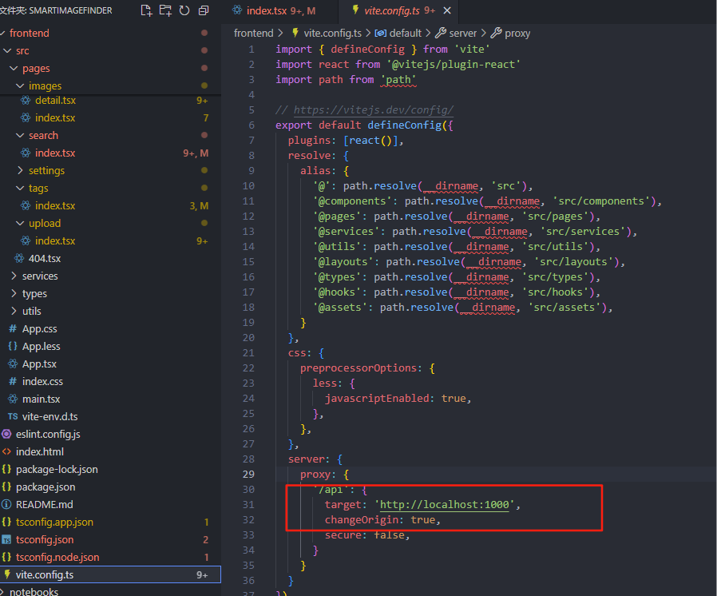
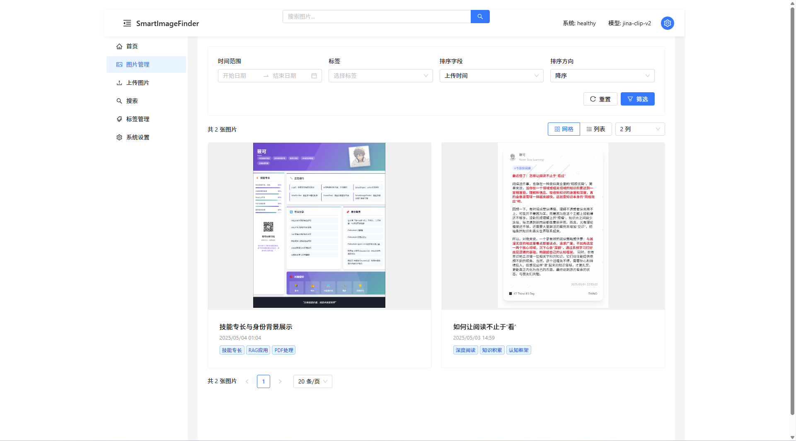
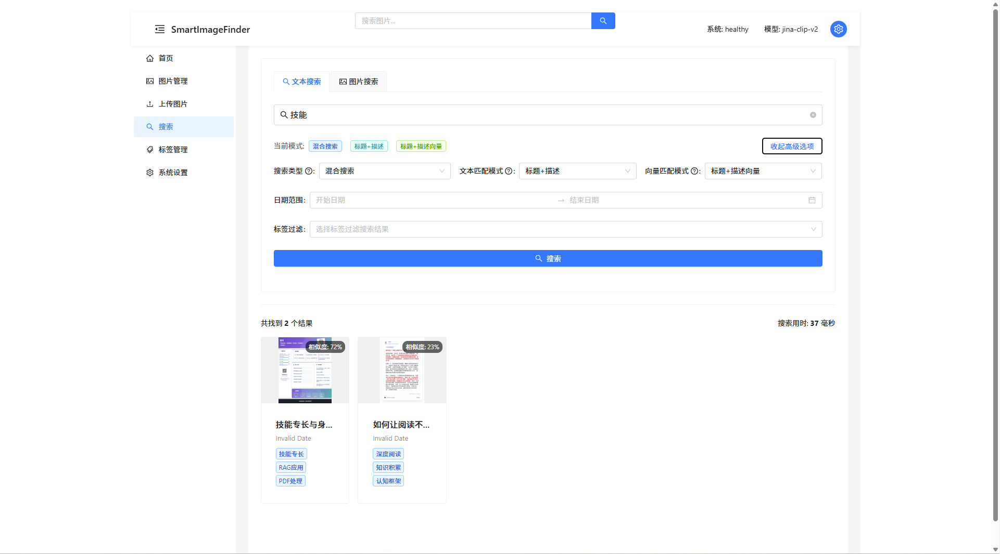

# SmartImageFinder 前端设计文档

## 1. 概述

SmartImageFinder 前端是一个基于 React、TypeScript 和 Ant Design 构建的现代化单页应用程序，是整个系统的用户交互界面。前端采用组件化和模块化的设计理念，实现了与后端 API 的无缝对接，提供了良好的用户体验和强大的图像管理与搜索功能。

### 1.1 设计目标

- **用户友好性**：提供直观、简洁的界面，降低用户使用门槛
- **响应式设计**：适配不同尺寸的设备，包括桌面、平板和移动端
- **高性能**：保证在处理大量图像数据时的流畅体验
- **可扩展性**：模块化设计，便于后续功能扩展
- **美观统一**：遵循统一的设计语言，保持整体风格一致

### 1.2 技术栈

- **核心框架**：React 18
- **开发语言**：TypeScript 5.7+
- **UI 框架**：Ant Design 5.x
- **路由管理**：React Router 7.x
- **HTTP 客户端**：Axios
- **构建工具**：Vite 6.x
- **样式处理**：Less
- **代码质量**：ESLint

## 2. 架构设计

SmartImageFinder 前端采用经典的 React 应用架构，基于组件化、模块化的设计理念，同时通过路由系统实现页面划分，通过服务层统一管理 API 调用。



### 2.1 总体架构

前端架构分为以下几个主要部分：

1. **UI 层**：包含所有视图组件和页面
   - 全局布局组件
   - 页面组件
   - 可复用功能组件
   - 基础 UI 组件

2. **状态管理层**：基于 React Hooks 实现组件内状态和跨组件状态共享

3. **服务层**：API 调用和数据处理
   - API 服务
   - 数据转换和预处理

4. **工具层**：通用功能和辅助工具
   - 工具函数
   - 类型定义
   - 常量配置

### 2.2 技术架构


### 2.3 目录结构

前端源代码采用以下目录结构组织：

```
src/
  ├── assets/         # 静态资源
  ├── components/     # 公共组件
  ├── hooks/          # 自定义React Hooks
  ├── layouts/        # 布局组件
  ├── pages/          # 页面组件
  │   ├── home/       # 首页
  │   ├── images/     # 图片管理
  │   ├── search/     # 搜索页面
  │   ├── settings/   # 系统设置
  │   ├── tags/       # 标签管理
  │   └── upload/     # 上传页面
  ├── services/       # API服务
  ├── types/          # TypeScript类型定义
  └── utils/          # 工具函数
```

## 3. 核心组件

### 3.1 主布局组件 (MainLayout)

MainLayout 是整个应用的主框架，提供了一致的导航和布局体验，包含以下元素：

- 顶部导航栏：应用标题、搜索框和系统状态指示器
- 侧边菜单：主要功能导航
- 内容区域：根据路由渲染不同的页面内容

```tsx
// MainLayout 核心结构
<Layout style={{ minHeight: '100vh' }}>
  <Header className="main-header">
    {/* 顶部导航栏组件 */}
  </Header>
  <Layout>
    <Sider>
      {/* 侧边菜单组件 */}
    </Sider>
    <Layout>
      <Content>
        {/* 通过 Outlet 渲染路由内容 */}
        <Outlet />
      </Content>
    </Layout>
  </Layout>
</Layout>
```

### 3.2 图片卡片组件 (ImageCard)

ImageCard 是展示图片的核心组件，用于在多个页面中统一呈现图片及其相关信息，包括：

- 图片预览
- 图片标题和创建时间
- 标签显示
- 相似度指示器（搜索结果中）
- 交互事件处理

```tsx
// ImageCard 组件
const ImageCard: React.FC<ImageCardProps> = ({ 
  image, 
  onClick,
  showTags = false,
  showSimilarity = false,
  onTagClick
}) => {
  // 处理图片和标签显示逻辑
  return (
    <Card
      hoverable
      cover={}
      onClick={handleClick}
    >
      {/* 图片信息、标签和相似度显示 */}
    </Card>
  );
};
```

### 3.3 图片上传组件

上传组件支持多种上传方式：

- 拖拽上传
- 文件选择器
- 批量上传
- 上传前预览和基本信息编辑

上传组件融合了 AI 分析功能，可以自动生成标题、描述和标签。

## 4. 页面设计

### 4.1 首页 (Home)

首页提供系统整体概览和快速访问入口：


**主要功能**：
- 系统状态卡片展示
- 最近上传图片展示
- 热门标签导航
- 快速访问链接

**实现技术**：
- 系统状态和图片数据通过并行请求获取
- 数据展示使用卡片和栅格布局
- 热门标签使用颜色差异化显示

### 4.2 图片管理页面 (Images)

图片管理页面是系统的核心功能之一，提供图片浏览、筛选和管理功能：



**主要功能**：
- 图片网格/列表视图切换
- 多维度筛选（时间、标签等）
- 排序选项
- 分页浏览
- 图片详情查看和编辑

**实现技术**：
- 响应式网格布局
- 表单控件和抽屉组件
- 动态查询参数构建
- 虚拟化列表提升性能

### 4.3 搜索页面 (Search)

搜索页面是系统的核心特色功能，支持多种搜索方式：



**主要功能**：
1. **文本搜索**：通过文字查询相关图片
   - 传统文本匹配
   - 向量语义搜索
   - 混合搜索

2. **图像搜索**：上传图片查找相似内容
   - 图像特征匹配
   - 图像到文本匹配
   - 权重可调整

3. **相似图像搜索**：基于已有图片查找相似内容

**实现技术**：
- 选项卡分隔不同搜索模式
- 上传组件和预览功能
- 权重调节滑块
- 搜索结果高效渲染

### 4.4 上传页面 (Upload)

上传页面提供图片上传和智能分析功能：


**主要功能**：
- 拖拽上传和多选上传
- 上传进度展示
- AI自动标注（标题、描述、标签）
- 批量处理

**实现技术**：
- 拖拽上传组件
- 进度条和状态跟踪
- 表单和模态框
- 批量操作状态管理

### 4.5 标签管理页面 (Tags)

标签管理页面提供标签的统一查看和管理：

**主要功能**：
- 标签列表和使用频率统计
- 标签云可视化
- 标签搜索和筛选
- 标签操作（查看关联图片）

**实现技术**：
- 表格组件
- 标签云组件
- 搜索和过滤功能
- 导航链接

### 4.6 系统设置页面 (Settings)

系统设置页面提供系统配置和维护功能：

**主要功能**：
- 系统状态展示
- 存储设置
- API 设置
- 模型设置
- 缓存管理

**实现技术**：
- 表单组件
- 卡片布局
- 数据校验
- 确认对话框

## 5. 数据流

### 5.1 前后端交互模型

前端通过统一的API服务层与后端交互：


### 5.2 API服务设计

API服务采用模块化设计，按功能域划分：

```typescript
// API 服务结构
const api = axios.create({
  baseURL: '/api/v1',
  timeout: 30000,
});

// 图片服务
const imageService = {
  getImages: (params) => api.get('/images', { params }),
  getImageDetail: (uuid) => api.get(`/images/${uuid}`),
  // ...其他方法
};

// 搜索服务
const searchService = {
  textSearch: (params) => api.get('/search/text', { params }),
  imageSearch: (data) => api.post('/search/image', data),
  // ...其他方法
};

// 其他服务...
```

### 5.3 错误处理

前端实现了统一的错误处理机制：

- 全局拦截器捕获所有API错误
- 统一的错误响应格式
- 按错误类型显示不同提示
- 关键操作错误重试机制

```typescript
// 响应拦截器
api.interceptors.response.use(
  (response) => response.data,
  (error) => {
    // 统一错误处理
    const errorResponse = {
      status: 'error',
      error: {
        code: error.code || 'UNKNOWN_ERROR',
        message: error.response?.data?.error?.message || error.message || '未知错误',
      },
    };
    // 返回处理后的错误
    return Promise.reject(errorResponse);
  }
);
```

## 6. 响应式设计

### 6.1 布局自适应

系统采用响应式布局，适配不同尺寸设备：

- 基于 Ant Design 的栅格系统
- 媒体查询调整布局
- 组件样式自适应

```less
// 响应式布局示例
@media (max-width: 768px) {
  .main-header {
    padding: 0 12px;
  }
  
  .header-search {
    max-width: 300px;
  }
}

@media (min-width: 768px) and (max-width: 1400px) {
  .main-header {
    padding: 0 16px;
  }
  
  .header-search {
    max-width: 400px;
  }
}
```

### 6.2 组件响应式设计

关键组件针对不同屏幕尺寸有特定优化：

- 图片卡片自适应尺寸
- 表格在小屏幕上简化显示
- 导航菜单可折叠
- 搜索表单布局自适应

```tsx
// 响应式栅格示例
<Row gutter={[16, 16]}>
  {recentImages.map(image => (
    <Col xs={12} sm={8} md={6} key={image.uuid}>
      <ImageCard image={image} />
    </Col>
  ))}
</Row>
```

## 7. 性能优化

### 7.1 加载优化

- 路由组件懒加载
- 资源按需导入
- 图片懒加载和渐进式加载

### 7.2 渲染优化

- 虚拟列表渲染大量图片
- React.memo 减少不必要的重渲染
- 分页和无限滚动加载

### 7.3 网络优化

- API请求防抖和节流
- 数据缓存
- 并行请求优化

## 8. 用户体验设计

### 8.1 交互设计原则

- **即时反馈**：操作后立即给予视觉反馈
- **容错设计**：防止用户误操作，提供撤销机制
- **一致性**：保持界面元素和交互方式的一致
- **简洁明了**：减少不必要的步骤和干扰

### 8.2 视觉设计

- 统一的色彩系统
- 清晰的视觉层次
- 适当的空间间隔
- 合理的动效设计

### 8.3 特色交互

- 图片悬停放大效果
- 标签交互和过滤
- 拖拽排序和分组
- 搜索建议和自动完成

## 9. 安全性考虑

### 9.1 接口安全

- API输入验证
- 敏感数据处理
- CSRF防护

### 9.2 用户数据安全

- 避免敏感信息泄露
- 本地存储安全管理
- 图片上传安全检查

## 10. 未来扩展

### 10.1 功能扩展

- 用户认证和权限系统
- 图片编辑器集成
- 多语言支持
- 主题定制

### 10.2 技术升级

- 状态管理框架集成
- SSR 支持
- PWA 功能
- WebSocket 实时通信

## 11. 设计决策

### 11.1 技术选择理由

- **React**：组件化开发模型，丰富的生态系统，良好的性能
- **TypeScript**：类型安全，提升代码质量和可维护性
- **Ant Design**：成熟的企业级UI库，丰富的组件
- **Vite**：快速的开发体验，优秀的构建性能

### 11.2 架构决策

- **组件粒度**：适中的组件粒度，平衡可复用性和维护成本
- **状态管理**：基于React Hooks的状态管理，避免过度抽象
- **API设计**：模块化API服务，按功能域划分，便于维护
- **样式方案**：CSS-in-JS与Less结合，保持样式作用域隔离

## 12. 总结

SmartImageFinder 前端采用了现代化的技术栈和架构设计，实现了高效、流畅、可扩展的用户界面。通过组件化、模块化的设计，前端能够灵活适应业务需求的变化，同时保持代码的可维护性。响应式设计确保了在各种设备上的良好体验，性能优化策略则保证了在处理大量图像数据时的流畅表现。