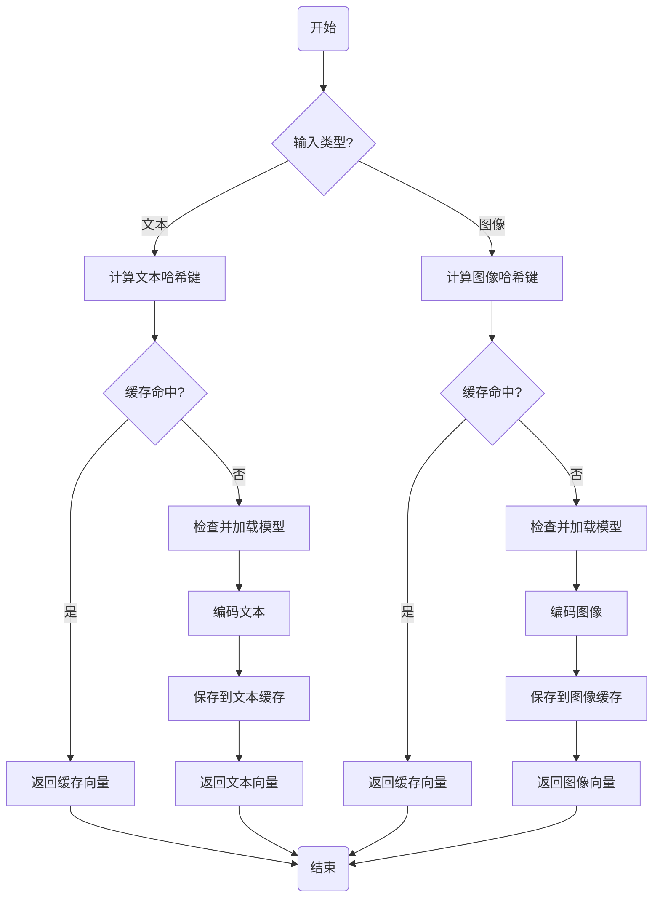

# SmartImageFinder 向量生成设计

## 概述

向量生成是 SmartImageFinder 系统的核心组件之一，负责将图片和文本转换为高维度的数学向量（嵌入）。这些向量捕捉了内容的语义信息，使得系统能够执行基于内容的相似度搜索（如以文搜图、以图搜图）。本模块使用 `sentence-transformers` 库加载预训练的多模态模型（如 Jina CLIP V2），并提供统一的接口来编码图片和文本数据，同时集成了缓存机制以提高效率。

## 技术选型

* **库**: `sentence-transformers` - 一个用于生成句子、文本和图像嵌入的流行 Python 框架
* **模型**: 默认使用 Jina CLIP V2，可通过配置自定义
* **缓存**: `diskcache` - 提供高效的基于磁盘的缓存机制
* **向量维度**: 1024维（由CLIP模型决定）

## 模块架构

向量生成模块采用函数式设计，主要包含以下组件：

1. **模型加载与管理**:
   * `load_model()`: 加载配置中指定的模型
   * `get_model()`: 返回已加载的模型实例，如未加载则先加载

2. **向量编码函数**:
   * `encode_text()`: 将文本编码为向量
   * `encode_image()`: 将图像编码为向量

3. **缓存机制**:
   * `get_text_cache_key()`: 为文本生成缓存键
   * `get_image_cache_key()`: 为图像生成缓存键
   * 使用`diskcache`管理向量缓存，避免重复计算

## 缓存策略

为提升性能，系统实现了两级缓存策略：

1. **缓存键生成**:
   * 文本缓存键: 基于文本内容的MD5哈希
   * 图像缓存键: 基于图像内容（非文件名）的MD5哈希

2. **缓存管理**:
   * 文本和图像使用独立的缓存目录
   * 支持自动缓存过期和大小限制
   * 通过配置可调整最大缓存大小（默认1.5GB）

## 工作流程



## 关键功能

### 文本向量编码

```python
def encode_text(text: Union[str, List[str]], cache_dir=None) -> np.ndarray:
    """将文本或文本列表编码成向量。
    
    参数:
        text: 单个文本字符串或文本列表
        cache_dir: 自定义缓存目录(可选)
        
    返回:
        numpy.ndarray: 归一化的文本向量表示
    """
    # 使用缓存
    cache_dir = cache_dir or settings.TEXT_VECTOR_CACHE_DIR
    
    # 先尝试从缓存获取
    cache_key = get_text_cache_key(text)
    cache_instance = diskcache.Cache(directory=cache_dir, 
                                     size_limit=settings.MAX_CACHE_SIZE_GB * 2**30)
    
    embeddings = cache_instance.get(cache_key)
    if embeddings is not None:
        return embeddings
    
    # 缓存未命中，计算向量
    model_instance = get_model()
    embeddings = model_instance.encode(text, normalize_embeddings=True)
    
    cache_instance.set(cache_key, embeddings)
    
    return embeddings
```

### 图像向量编码

```python
def encode_image(image_input: Union[Image.Image, List[Image.Image], str, List[str]], 
                 cache_dir=None) -> np.ndarray:
    """将图像(PIL Image、路径)或图像列表编码成向量。
    
    参数:
        image_input: PIL图像对象、图像文件路径或它们的列表
        cache_dir: 自定义缓存目录(可选)
        
    返回:
        numpy.ndarray: 归一化的图像向量表示
    """
    # 使用缓存
    cache_dir = cache_dir or settings.IMAGE_VECTOR_CACHE_DIR
    
    try:
        # 先尝试从缓存获取
        cache_key = get_image_cache_key(image_input)
        cache_instance = diskcache.Cache(directory=cache_dir,
                                         size_limit=settings.MAX_CACHE_SIZE_GB * 2**30)
        
        embeddings = cache_instance.get(cache_key)
        if embeddings is not None:
            return embeddings
    except Exception as e:
        # 缓存错误时继续处理，不中断流程
        print(f"获取图像缓存时出错: {e}")
    
    # 缓存未命中，计算向量
    model_instance = get_model()
    
    # 处理输入格式
    if isinstance(image_input, (Image.Image, str)):
        images_to_encode = [image_input]
    else:
        images_to_encode = image_input

    # 编码图像
    embeddings = model_instance.encode(images_to_encode, normalize_embeddings=True)
    
    # 尝试缓存结果
    try:
        if isinstance(image_input, (Image.Image, str)):
            # 单个向量情况，缓存结果
            cache_instance.set(cache_key, embeddings[0])
        else:
            cache_instance.set(cache_key, embeddings)
    except Exception as e:
        # 缓存错误时继续处理，返回结果
        print(f"缓存图像向量时出错: {e}")
    
    # 返回适当格式的结果
    if isinstance(image_input, (Image.Image, str)):
        return embeddings[0]
    return embeddings
```

## 配置选项

向量生成模块依赖于以下配置选项:

| 配置项 | 说明 | 默认值 |
|--------|------|--------|
| MODEL_PATH | 模型路径或名称 | "./models/jina-clip-v2" |
| TEXT_VECTOR_CACHE_DIR | 文本向量缓存目录 | "./data/caches/text_vector_cache" |
| IMAGE_VECTOR_CACHE_DIR | 图像向量缓存目录 | "./data/caches/image_vector_cache" |
| VECTOR_DIM | 向量维度 | 1024 |
| MAX_CACHE_SIZE_GB | 每个缓存的最大大小(GB) | 1.5 |
| USE_CACHE | 是否使用缓存功能 | True |

## 优化策略

1. **延迟加载**: 模型仅在首次需要时加载，减少启动时间和内存占用
2. **向量归一化**: 所有向量在编码时自动归一化，便于后续计算余弦相似度
3. **内容哈希**: 缓存键基于实际内容计算，而非文件名，确保相同内容只计算一次
4. **错误容忍**: 缓存操作出错时不中断主流程，确保系统稳定性
5. **统一接口**: 对文本和图像提供统一的编码接口，简化上层应用使用

## 注意事项

1. **模型依赖**: 确保正确安装了 `sentence-transformers` 库及其依赖
2. **初始化时间**: 首次加载大型模型可能需要几秒到几十秒，后续使用则很快
3. **内存占用**: 模型加载后会占用大量内存（通常为数GB），请确保系统有足够内存
4. **缓存清理**: 系统不会自动清理过期缓存，可能需要定期手动清理
5. **向量维度**: 使用不同模型时，需要同步修改 VECTOR_DIM 配置
