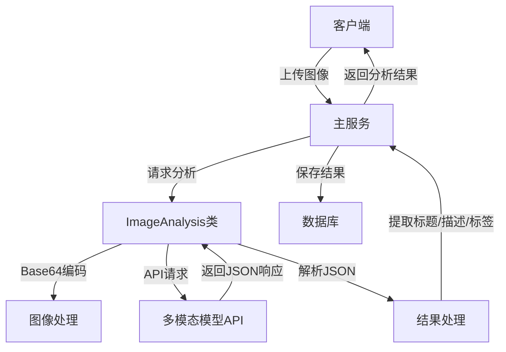
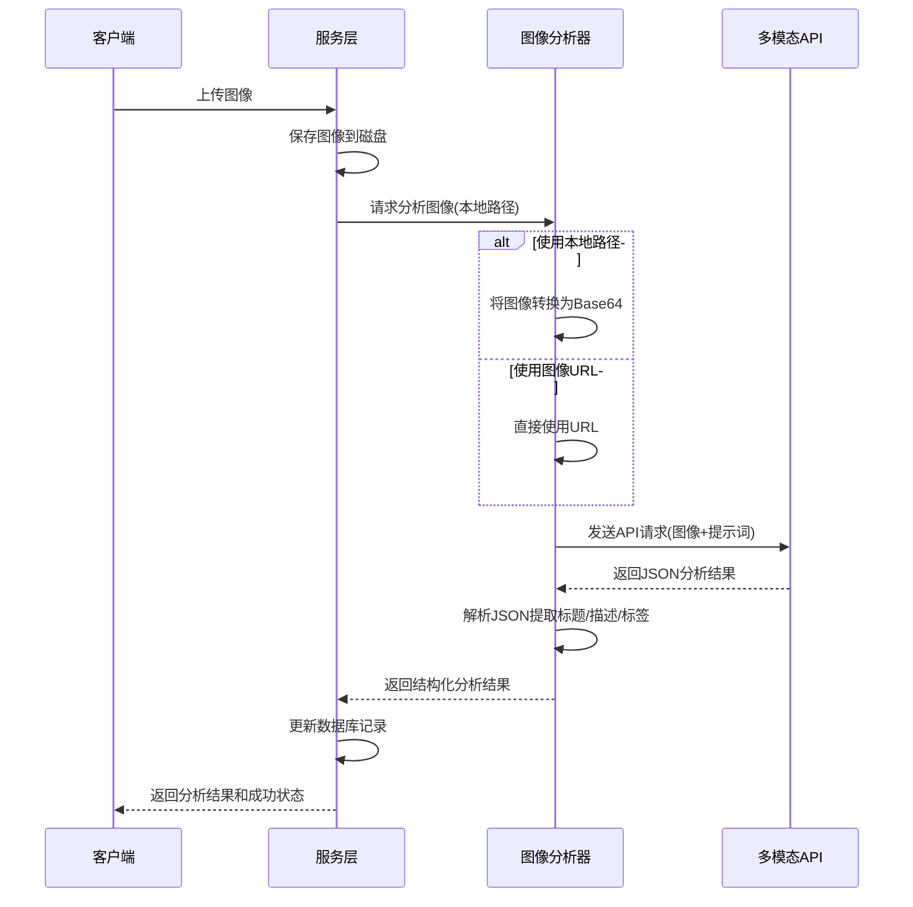

# SmartImageFinder 多模态内容生成设计

## 1. 多模态生成概述

SmartImageFinder 系统的多模态内容生成模块负责基于图片内容自动分析和生成与图片相关的文本内容，包括智能标题、详细描述和语义标签。该功能利用先进的硅基流动多模态模型 API，实现了图像与文本之间的智能关联，极大地提升了图片管理的智能化程度和搜索体验。本文档详细说明该模块的设计理念、技术实现、工作流程以及关键优化策略。

## 2. 提示词设计

系统使用精心设计的提示词模板，引导模型生成高质量、结构化的内容。提示词设计考虑以下关键因素：

```python
MULTIMODAL_PROMPT = """
请分析这张图片并生成一个10字以内的标题、50字以内的图片描述和1-3个以内的关键标签，使用JSON格式输出。

分析以下方面:
1. 图像类型（图表、示意图、照片等）
2. 主要内容/主题
3. 包含的关键信息点
4. 图像的可能用途

输出格式必须严格为:
{
  "title": "简洁标题(10字以内)",
  "description": "详细描述(50字以内)",
  "tags": ["标签1", "标签2", "标签3"]
}

只返回JSON，不要有其他说明文字。
"""
```

### 提示词设计原则

- **结构化输出**：要求模型以特定JSON格式返回，便于解析和使用
- **明确任务目标**：清晰指明需要生成标题、描述和标签三种内容
- **明确输出约束**：指定标题字数、描述字数和标签数量限制
- **分析维度引导**：提供具体的分析方向，确保生成内容全面且相关
- **格式强化**：强调只返回JSON，避免模型生成额外的解释文本

## 3. 技术架构

### 3.1 核心组件

图像分析模块基于以下核心技术组件：

1. **OpenAI多模态API**：默认使用OpenAI的GPT-4 Vision或类似多模态大模型
2. **动态模型选择**：支持配置多种多模态模型，如Qwen/Qwen2.5-VL-32B-Instruct等
3. **Base64编码**：图像通过Base64编码传输，确保数据完整性
4. **内容解析**：专门的JSON解析器处理多模态API返回的结果

### 3.2 架构设计



### 3.3 `ImageAnalysis` 核心类

`ImageAnalysis`类是多模态内容生成的核心实现，负责与多模态API交互并处理返回结果：

```python
class ImageAnalysis:
    """
    图像文本提取器类，用于将图像内容转换为文本描述和标题。
    
    该类使用OpenAI的多模态模型分析图像内容，生成描述性文本和标题。
    """

    def __init__(
        self,
        api_key: str = None,
        base_url: str = None,
        prompt: str | None = None,
    ):
        """初始化 ImageAnalysis 实例"""
        # API配置、客户端初始化和提示词设置
        # ...
    
    def is_model_available(self, model_name: str = None) -> bool:
        """检查指定的模型是否可用"""
        # ...
            
    def get_available_models(self) -> List[str]:
        """获取系统中可用的多模态模型列表"""
        # ...

    def analyze_image(
        self,
        image_url: str = None,
        local_image_path: str = None,
        model: str = None,
        detail: str = "low",
        prompt: str = None,
        temperature: float = 0.1,
    ) -> Dict[str, str]:
        """分析图像并生成JSON格式的标题、描述和标签"""
        # ...
```

## 4. 工作流程

图像分析和内容生成遵循以下工作流程：



### 4.1 图像准备与提交

1. **图像获取**：支持通过本地路径或URL提供图像
2. **Base64编码**：本地图像被编码为Base64格式
3. **API参数设置**：根据配置设置模型、细节级别和温度参数

### 4.2 JSON解析与处理

系统使用专用的解析函数`extract_json_content`，处理各种可能的API响应格式：

```python
def extract_json_content(text: str) -> Dict[str, str]:
    """从文本中提取JSON内容"""
    # 尝试定位JSON内容的开始和结束位置
    json_start = text.find('{')
    json_end = text.rfind('}')
    
    if (json_start != -1 and json_end != -1 and json_end > json_start):
        # 提取并解析JSON
        # ...
    
    # 处理异常情况
    # ...
```

该函数具有强大的容错能力：
- 能够从混合文本中提取JSON部分
- 确保返回结果包含所有必要的键（title、description、tags）
- 处理格式错误的响应，提供有意义的默认值

## 5. 配置管理

多模态内容生成模块依赖于以下关键配置项：

| 配置项 | 说明 | 默认值/示例 |
|--------|------|------------|
| OPENAI_API_KEY | OpenAI API密钥 | 无，需用户提供 |
| OPENAI_API_BASE | API基础URL | "https://api.openai.com/v1" |
| VISION_MODEL | 默认使用的视觉模型 | "Qwen/Qwen2.5-VL-32B-Instruct" |
| AVAILABLE_VISION_MODELS | 可用的视觉模型列表 | ["gpt-4-vision-preview", "Qwen/Qwen2.5-VL"] |
| AI_ENABLED | 是否启用AI功能 | true |

配置项可通过系统的配置模块进行管理，支持动态修改和持久化。

## 6. 性能优化

### 6.1 图像处理优化

为提升性能并减少API请求负载，系统实现了以下优化：

1. **图像哈希**：使用`get_image_hash`函数计算图像的部分内容哈希值，用于快速识别重复图像
   ```python
   def get_image_hash(image_path: str) -> str:
       """计算图片文件的部分内容哈希值，用于快速识别"""
       # 通过读取前8K和后8K内容生成哈希
       # ...
   ```

2. **细节级别控制**：根据需要选择不同的细节级别（低/高/自动）
3. **温度参数调整**：默认使用低温度值(0.1)，确保输出结果的稳定性和一致性

### 6.2 错误处理与日志

模块实现了全面的错误处理策略：

1. **异常捕获与恢复**：所有API调用都包含在try/except块中，确保单次失败不会导致整个流程崩溃
2. **结构化日志**：关键操作点都有详细日志记录，包括操作耗时、结果状态
3. **优雅降级**：当API不可用时，系统返回有意义的错误信息并继续处理其他任务

## 7. 集成与应用场景

### 7.1 与其他模块的集成

多模态内容生成模块与以下系统组件紧密集成：

1. **图像上传流程**：新上传的图像自动触发分析流程
2. **向量生成模块**：生成的标题和描述用于创建语义向量，支持向量搜索
3. **标签管理系统**：自动生成的标签集成到系统的标签管理功能中

### 7.2 应用场景

该模块支持以下核心应用场景：

1. **图像批量导入**：大量图片导入时自动生成元数据
2. **缺失元数据补全**：为历史图像补充标题、描述和标签
3. **智能搜索增强**：提供丰富的文本内容以提升搜索效果
4. **内容组织优化**：通过自动标签简化内容分类和组织

## 8. 未来扩展方向

1. **多模型支持**：扩展对更多第三方多模态模型的支持
2. **批量处理优化**：实现批量图像分析以减少API调用次数
3. **自定义提示词模板**：允许用户根据特定领域需求自定义提示词
4. **结果缓存**：对相同或相似图像的分析结果进行缓存
5. **实时进度反馈**：对于大批量处理任务提供实时进度更新

## 9. 限制与注意事项

1. **API依赖性**：功能依赖于第三方API的可用性和稳定性
2. **成本控制**：多模态API调用通常有较高成本，需合理规划使用频率
3. **隐私考虑**：图像通过API处理涉及数据传输，需注意数据隐私
4. **响应时间**：复杂图像分析可能需要数秒响应时间
5. **输出质量变化**：不同模型和不同版本的输出质量可能有所差异
