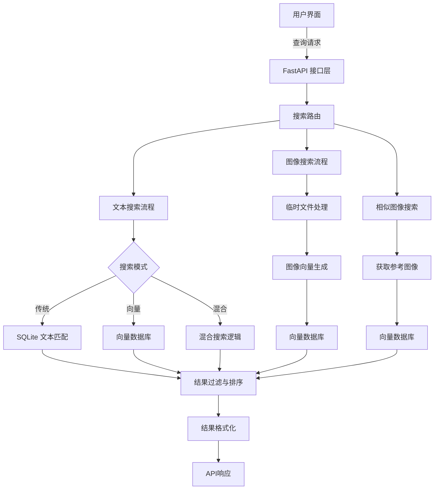
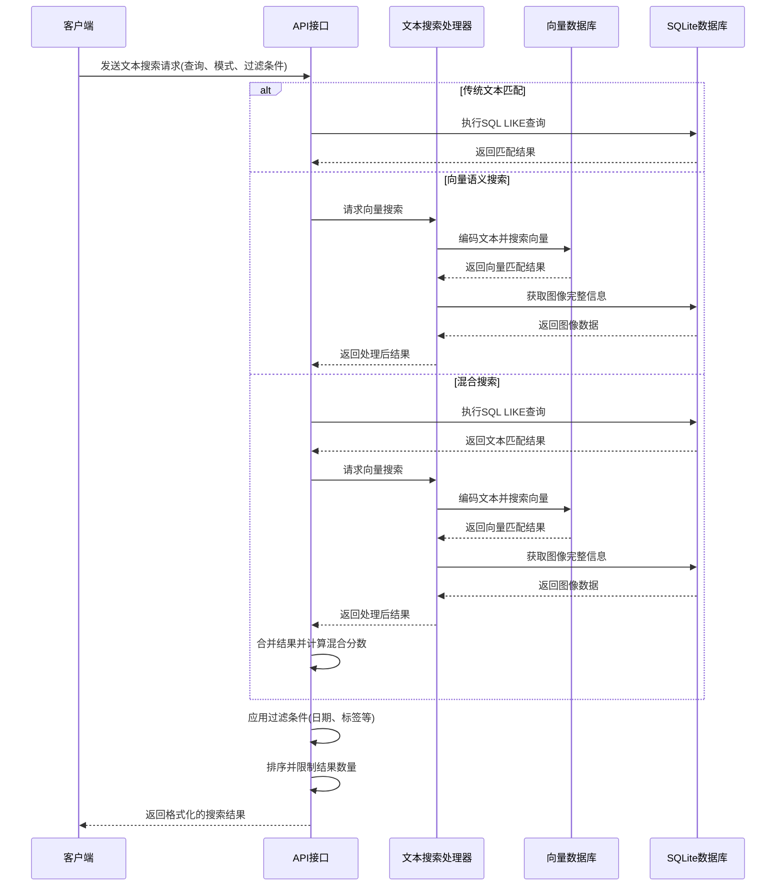
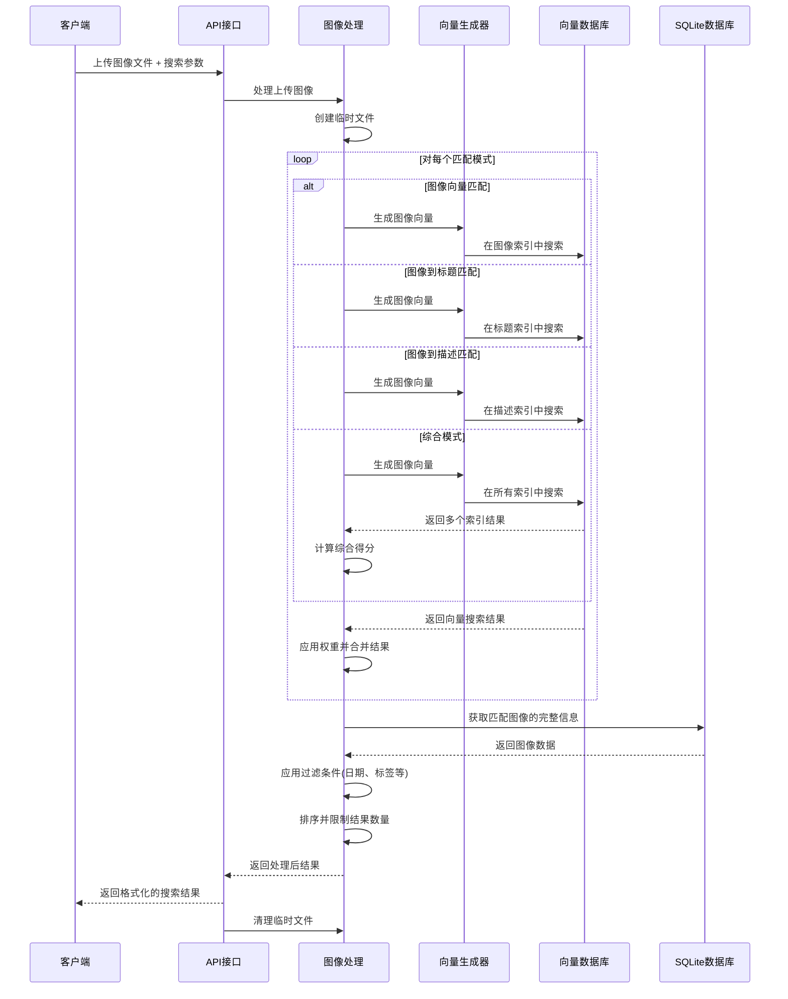
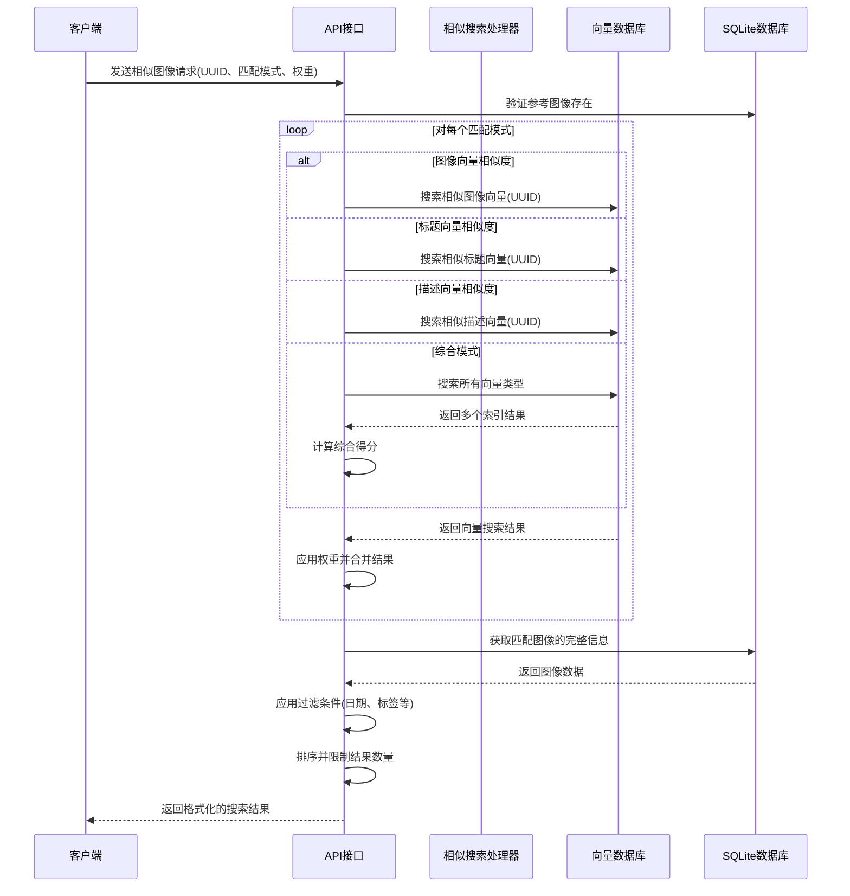

# SmartImageFinder 多模态搜索设计

## 1. 搜索系统概述

SmartImageFinder 系统的多模态搜索功能是其最核心的特性之一，支持文本搜索、图像搜索、以及基于已有图像的相似内容搜索。系统融合了传统文本匹配和现代向量语义搜索技术，实现了高性能、高相关性的图像检索体验。

搜索系统设计目标：

- **多模态检索**：支持文本-图像、图像-图像跨模态搜索
- **语义理解**：超越关键词匹配，实现内容语义层面的理解
- **灵活筛选**：提供多维度过滤和排序选项
- **高效性能**：在大型图库中也能保持快速响应时间
- **精确度平衡**：在搜索精确度和速度之间寻求最佳平衡点

## 2. 搜索模式设计

系统实现了三种主要搜索模式，以满足不同的使用场景：

### 2.1 文本搜索 (Text Search)

用户输入文本查询，系统返回相关图像。这是最常见的搜索方式，支持三种子模式：

1. **传统文本匹配** (`SearchType.TEXT`)
   - 使用SQLite的LIKE操作符进行文本匹配
   - 支持标题匹配、描述匹配或两者组合
   - 计算相关性分数并按分数降序排列结果

2. **向量语义搜索** (`SearchType.VECTOR`)
   - 将查询文本转换为向量表示
   - 使用FAISS执行向量相似度搜索
   - 支持标题向量、描述向量或综合向量搜索

3. **混合搜索** (`SearchType.HYBRID`)
   - 结合传统文本匹配和向量语义搜索
   - 为两种搜索结果分配权重（文本40%，向量60%）
   - 计算混合分数，获得最佳效果

### 2.2 图像搜索 (Image Search)

用户上传一张图片作为查询，系统查找视觉上或语义上相似的图像：

1. **图像向量匹配** (`ImageVectorMatchMode.IMAGE`)
   - 将查询图片转换为视觉特征向量
   - 使用FAISS在图像向量索引中查找相似内容
   - 返回视觉上相似的图像结果

2. **图像到文本向量匹配** 
   - **图像到标题** (`ImageVectorMatchMode.TITLE`): 用图像向量搜索标题向量
   - **图像到描述** (`ImageVectorMatchMode.DESCRIPTION`): 用图像向量搜索描述向量
   - **综合匹配** (`ImageVectorMatchMode.COMBINED`): 同时搜索图像、标题、描述向量，综合评分

3. **多模式权重自定义**
   - 支持用户自定义不同匹配模式的权重
   - 系统根据加权分数对结果进行排序

### 2.3 相似图像搜索 (Similar Image Search)

基于系统中已存在的图片UUID，查找相似图像：

1. **多维度相似性**
   - 基于图像向量的视觉相似性
   - 基于标题向量的语义相似性
   - 基于描述向量的语义相似性
   - 多向量综合相似性评分

2. **权重自定义**
   - 支持自定义不同向量类型的权重
   - 默认配置为均匀权重分布

3. **参考图像评估**
   - 使用已存在图像的向量索引作为参考
   - 不需要重新计算向量，提高搜索效率

## 3. 系统架构

搜索功能通过多层架构实现高效、灵活的检索体验：



## 4. 关键工作流程

### 4.1 文本搜索流程



### 4.2 图像搜索流程



### 4.3 相似图像搜索流程



## 5. 关键API接口

### 5.1 文本搜索接口

```
GET /search/text
```

**参数**:
- `q`: 搜索查询文本
- `search_type`: 搜索类型 (text/vector/hybrid)
- `text_match_mode`: 文本匹配模式 (title/description/combined)
- `vector_match_mode`: 向量匹配模式 (title/description/combined)
- `limit`: 返回结果数量上限
- `start_date`: 开始日期过滤
- `end_date`: 结束日期过滤
- `tags`: 标签过滤，逗号分隔

**返回示例**:
```json
{
  "success": true,
  "data": {
    "results": [
      {
        "uuid": "550e8400-e29b-41d4-a716-446655440000",
        "title": "山顶风景",
        "description": "山顶俯瞰城市的全景照片，天空湛蓝",
        "filepath": "data/images/2023/05/550e8400-e29b-41d4-a716-446655440000.jpg",
        "score": 0.92,
        "tags": ["风景", "城市", "天空"]
      },
      // ... 更多结果
    ]
  },
  "metadata": {
    "query": "山顶城市风景",
    "search_type": "hybrid",
    "text_match_mode": "combined",
    "vector_match_mode": "combined",
    "total": 15,
    "time_ms": 124
  }
}
```

### 5.2 图像搜索接口

```
POST /search/image
```

**参数**:
- `image`: 要搜索的参考图片文件
- `search_type`: 搜索类型 (image/title/description/combined)
- `match_modes`: 匹配模式数组
- `weights`: 各匹配模式的权重，逗号分隔
- `limit`: 返回结果数量
- `start_date`: 开始日期过滤
- `end_date`: 结束日期过滤
- `tags`: 标签过滤，逗号分隔

**返回示例**:
```json
{
  "success": true,
  "data": {
    "results": [
      {
        "uuid": "660f9511-f30c-42e5-b817-557766551111",
        "title": "海边日落",
        "description": "金色的阳光洒在海面上，形成美丽的日落景色",
        "filepath": "data/images/2023/06/660f9511-f30c-42e5-b817-557766551111.jpg",
        "score": 0.87,
        "similarity_components": {
          "image": 0.91,
          "title": 0.72
        },
        "tags": ["日落", "海洋", "风景"]
      },
      // ... 更多结果
    ]
  },
  "metadata": {
    "search_type": "image",
    "match_modes": ["image", "title"],
    "weights": {
      "image": 0.7,
      "title": 0.3
    },
    "total": 12,
    "time_ms": 267
  }
}
```

### 5.3 相似图像搜索接口

```
GET /search/similar/{uuid}
```

**参数**:
- `uuid`: 参考图片的UUID
- `match_modes`: 匹配模式数组
- `weights`: 各匹配模式的权重，逗号分隔
- `limit`: 返回结果数量
- `start_date`: 开始日期过滤
- `end_date`: 结束日期过滤
- `tags`: 标签过滤，逗号分隔

**返回示例**:
```json
{
  "success": true,
  "data": {
    "results": [
      {
        "uuid": "770a8611-d31d-42f6-b928-668877662222",
        "title": "雪山风景",
        "description": "白雪皑皑的高山，天空蔚蓝",
        "filepath": "data/images/2023/07/770a8611-d31d-42f6-b928-668877662222.jpg",
        "score": 0.79,
        "similarity_components": {
          "image": 0.86,
          "description": 0.65
        },
        "tags": ["雪山", "自然", "风景"]
      },
      // ... 更多结果
    ]
  },
  "metadata": {
    "reference_uuid": "550e8400-e29b-41d4-a716-446655440000",
    "match_modes": ["image", "description"],
    "weights": {
      "image": 0.7,
      "description": 0.3
    },
    "total": 10,
    "time_ms": 158
  }
}
```

## 6. 过滤与排序机制

### 6.1 时间过滤

系统支持基于创建时间的范围过滤：
- 过滤指定日期之前或之后创建的图像
- 指定日期范围内创建的图像
- 通过SQL或内存过滤实现，取决于搜索模式

### 6.2 标签过滤

支持基于标签的过滤：
- 过滤包含任意指定标签的图像
- 支持多标签组合过滤
- 实现方式：SQL查询中的JSON包含检查或内存过滤

### 6.3 排序机制

搜索结果按照相关性分数排序：
- **文本搜索**：按照文本匹配程度或向量相似度
- **图像搜索**：按照视觉特征向量的相似度
- **混合模式**：综合加权计算多种相似度

## 7. 性能优化策略

为确保系统在大规模数据集上的高性能表现，实现了以下优化：

### 7.1 查询优化

1. **两阶段查询**：先执行向量检索，再获取完整元数据
2. **预抓取扩展**：获取超出限制数量的初始结果，以便在过滤后仍有足够结果
3. **向量检索优化**：使用FAISS索引进行高效相似度搜索

### 7.2 计算优化

1. **模型延迟加载**：仅在需要时加载向量模型
2. **临时文件处理**：上传图片搜索中高效地处理临时文件
3. **参数验证**：提前验证参数，避免不必要的计算

### 7.3 响应优化

1. **结果格式化**：统一的响应格式，包含元数据和性能指标
2. **处理时间计算**：跟踪并返回处理时间，便于性能监控
3. **错误处理**：统一的错误处理流程，提供详细的错误信息

## 8. 搜索质量评估

系统实现了多项机制来确保搜索结果的质量：

### 8.1 相关性评分

1. **传统文本匹配**：基于匹配位置（标题或描述）和匹配程度计算分数
2. **向量相似度**：使用余弦相似度（通过内积计算）评估语义相关性
3. **混合相关性**：将传统匹配和向量相似度按比例合并计算

### 8.2 多样性平衡

1. **可配置的匹配模式**：支持多种匹配模式组合，平衡精确性和多样性
2. **权重自定义**：允许用户通过权重调整不同模式的影响力
3. **综合模式**：平衡视觉特征和语义内容的重要性

## 9. 搜索功能扩展方向

系统设计为可扩展架构，未来可添加以下功能：

### 9.1 搜索扩展

1. **区域搜索**：支持图像特定区域的相似度搜索
2. **否定搜索**：支持排除某些特征的搜索条件
3. **组合查询**：支持复杂的布尔逻辑组合查询

### 9.2 性能扩展

1. **索引分片**：支持向量索引的分片以处理更大规模数据
2. **批量搜索**：支持一次请求多个查询条件
3. **搜索缓存**：针对常见查询实现结果缓存

### 9.3 用户体验扩展

1. **搜索建议**：为用户提供相关搜索建议
2. **个性化排序**：基于用户历史记录优化搜索结果排序
3. **搜索反馈**：收集用户反馈以改进搜索算法

## 10. 总结

SmartImageFinder 的多模态搜索系统通过整合传统数据库查询和现代向量语义搜索技术，提供了强大而灵活的图像检索功能。系统支持文本搜索、图像搜索和相似图像搜索三种主要模式，并通过多种匹配策略和权重配置，使用户能够精确地找到所需的图像内容。系统架构注重性能和可扩展性，能够有效处理大量图像数据，同时保持良好的响应时间和搜索质量。