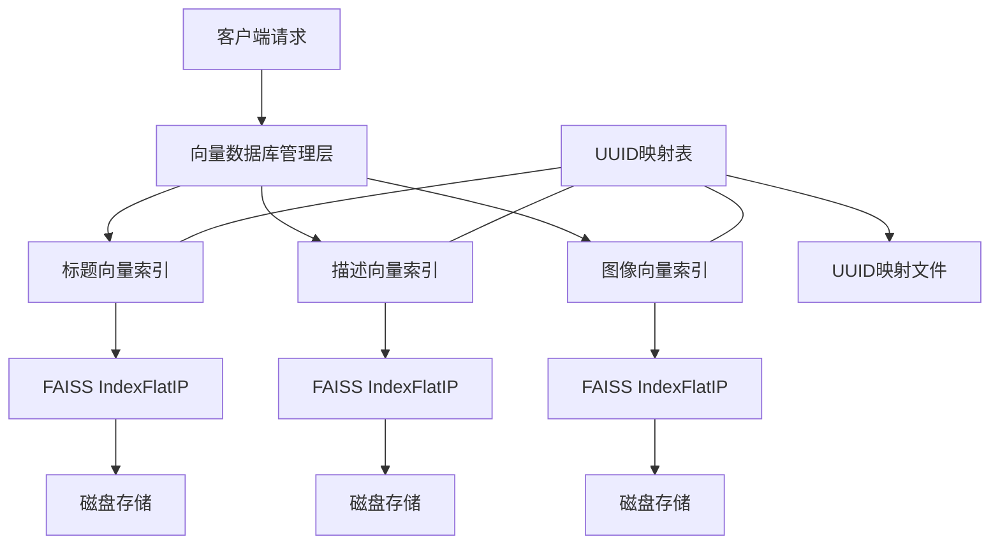
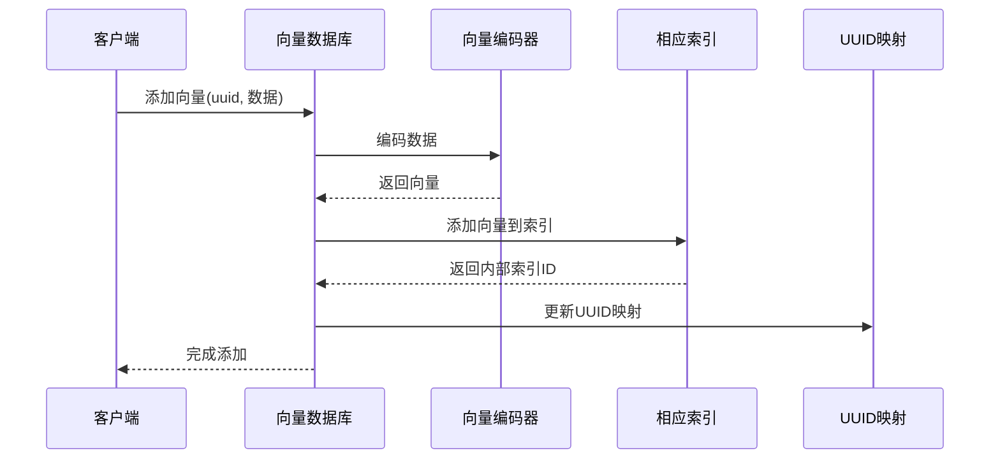
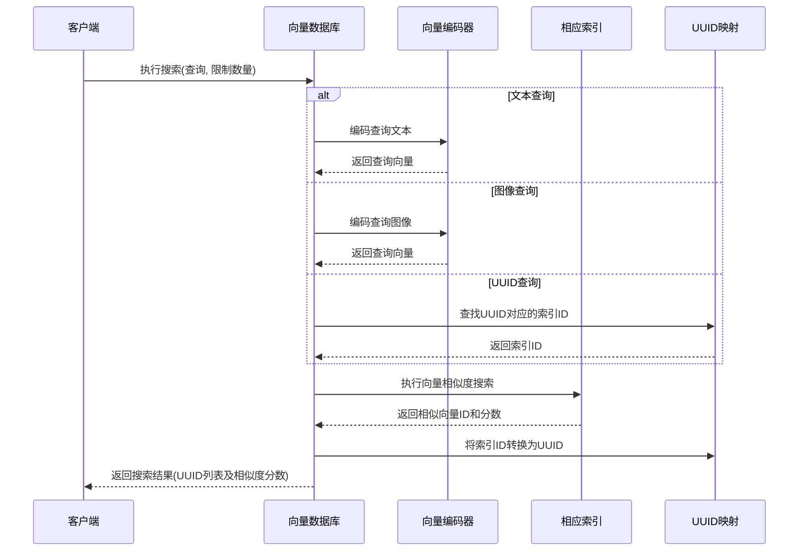

# SmartImageFinder 向量数据库设计

## 概述

SmartImageFinder 系统使用 FAISS (Facebook AI Similarity Search) 实现高效的向量相似度搜索功能，支持文本-图像、图像-图像、文本-文本等多种搜索模式。向量数据库模块负责管理三种独立的向量索引（标题向量、描述向量、图像向量），提供统一的API进行向量的添加、检索和删除操作。

## 技术选型

* **向量检索引擎**: FAISS (Facebook AI Similarity Search) CPU 版本
* **索引类型**: IndexFlatIP（内积相似度索引）
* **持久化**: 基于文件的索引存储和 pickle 序列化
* **向量标识**: UUID 映射机制

## 系统架构



## 核心组件

### 1. 向量索引基类 (VectorIndex)

`VectorIndex` 是一个抽象基类，为所有类型的向量索引提供通用功能：

- 索引初始化和加载
- 向量添加
- 向量搜索（多种搜索模式）
- 索引持久化

```python
class VectorIndex(abc.ABC):
    """向量索引抽象基类"""
    
    def __init__(self, index_path: str, index_type: str, uuid_map: Dict, encode_func: Callable):
        """初始化向量索引
        
        参数:
            index_path: 索引文件路径
            index_type: 索引类型标识符 ("title", "description", "image")
            uuid_map: UUID映射字典的引用
            encode_func: 编码函数，接受输入数据并返回向量
        """
        # 实现细节...
        
    def init_index(self):
        """初始化索引"""
        # 实现细节...
    
    def save_index(self):
        """保存索引到磁盘"""
        # 实现细节...
    
    def add_vector(self, uuid: str, data):
        """添加向量到索引"""
        # 实现细节...
    
    def search(self, query, limit: int = 20) -> List[Dict[str, Any]]:
        """搜索相似向量"""
        # 实现细节...
    
    def search_by_vector(self, query_vector: np.ndarray, limit: int = 20) -> List[Dict[str, Any]]:
        """使用向量直接搜索相似向量"""
        # 实现细节...
    
    def search_by_id(self, idx: int, limit: int = 20) -> List[Dict[str, Any]]:
        """通过内部索引ID搜索相似向量"""
        # 实现细节...
```

### 2. 专用索引类

系统实现了两种专用索引类，继承自基类并添加特定功能：

#### TextVectorIndex
```python
class TextVectorIndex(VectorIndex):
    """文本向量索引类"""
    
    def __init__(self, index_path: str, index_type: str, uuid_map: Dict):
        super().__init__(index_path, index_type, uuid_map, encode_text)
```

#### ImageVectorIndex
```python
class ImageVectorIndex(VectorIndex):
    """图像向量索引类"""
    
    def __init__(self, index_path: str, uuid_map: Dict):
        super().__init__(index_path, "image", uuid_map, self._encode_image_wrapper)
    
    def _encode_image_wrapper(self, image_path: str) -> np.ndarray:
        """图像编码包装函数"""
        # 实现细节...
```

### 3. UUID映射机制

系统使用UUID映射表将图像唯一标识符与向量索引中的内部ID关联起来：

```python
# UUID映射结构示例
uuid_map = {
    "550e8400-e29b-41d4-a716-446655440000": {
        "title_id": 0,
        "description_id": 0,
        "image_id": 0
    },
    "660f9511-f30c-42e5-b817-557766551111": {
        "title_id": 1,
        "description_id": 1,
        "image_id": 1
    }
}
```

## 索引管理流程

### 初始化
```mermaid
sequenceDiagram
    participant System as 系统启动
    participant Map as UUID映射
    participant Title as 标题索引
    participant Desc as 描述索引
    participant Image as 图像索引
    
    System->>Map: 尝试加载UUID映射
    alt 映射文件存在
        Map-->>System: 加载成功
    else 映射文件不存在
        Map-->>System: 创建新映射
    end
    
    System->>Title: 初始化标题索引
    alt 索引文件存在
        Title-->>System: 加载现有索引
    else 索引文件不存在
        Title-->>System: 创建新索引
    end
    
    System->>Desc: 初始化描述索引
    alt 索引文件存在
        Desc-->>System: 加载现有索引
    else 索引文件不存在
        Desc-->>System: 创建新索引
    end
    
    System->>Image: 初始化图像索引
    alt 索引文件存在
        Image-->>System: 加载现有索引
    else 索引文件不存在
        Image-->>System: 创建新索引
    end
```

### 添加向量


### 搜索流程


## 性能优化

向量数据库模块实现了多种性能优化策略：

1. **延迟加载**: 索引仅在首次需要时初始化，减少启动时间
2. **内积相似度**: 使用内积相似度计算，对于归一化向量等同于余弦相似度，但计算效率更高
3. **UUID映射缓存**: 使用内存中的UUID映射表加速ID转换
4. **批量保存**: 提供单独的保存机制，避免每次添加向量都写入磁盘
5. **异常处理**: 健壮的错误处理机制，确保索引操作失败不会导致整个系统崩溃

## API 接口

向量数据库模块提供以下主要接口：

### 初始化和持久化

```python
def init_indices()
```
初始化所有向量索引和UUID映射

```python
def save_indices()
```
将所有索引和UUID映射保存到磁盘

### 向量管理

```python
def add_title_vector(uuid: str, title: str)
```
将标题向量添加到索引

```python
def add_description_vector(uuid: str, description: str)
```
将描述向量添加到索引

```python
def add_image_vector(uuid: str, image_path: str)
```
将图像向量添加到索引

```python
def delete_vectors(uuid: str)
```
从所有索引中标记删除指定UUID的向量

### 搜索功能

```python
def search_by_title(query_text: str, limit: int = 20)
```
通过标题文本查询向量索引

```python
def search_by_description(query_text: str, limit: int = 20)
```
通过描述文本查询向量索引

```python
def search_by_image(image_path: str, limit: int = 20)
```
通过图像路径查询向量索引

```python
def search_by_vector(query_vector: np.ndarray, index_type: str = "image", limit: int = 20)
```
根据向量类型搜索相似向量

```python
def search_by_uuid(uuid: str, limit: int = 20, search_type: str = "image")
```
通过UUID查找相似内容

```python
def search_by_text(query_text: str, limit: int = 20)
```
通过文本查询标题和描述向量索引，并合并结果

## 配置依赖

向量数据库模块依赖于以下配置项:

| 配置项 | 说明 | 默认值 |
|--------|------|--------|
| TITLE_INDEX_PATH | 标题向量索引文件路径 | ./data/faiss/title_vectors.faiss |
| DESCRIPTION_INDEX_PATH | 描述向量索引文件路径 | ./data/faiss/description_vectors.faiss |
| IMAGE_INDEX_PATH | 图像向量索引文件路径 | ./data/faiss/image_vectors.faiss |
| UUID_MAP_PATH | UUID映射文件路径 | ./data/faiss/uuid_map.pickle |
| VECTOR_DIM | 向量维度 | 1024 |

## 限制与注意事项

1. **删除操作**: 当前实现中，删除操作仅从UUID映射中移除条目，而不真正从索引中删除向量。定期重建索引可解决此问题。

2. **大规模索引**: FAISS的IndexFlatIP适合中小规模数据集(数万条记录)。对于更大规模数据，应考虑使用FAISS的近似最近邻索引类型。

3. **内存占用**: 所有索引都加载到内存中，可能导致较大内存占用。未来可考虑按需加载策略。

4. **原子性**: 当前实现不保证操作的原子性，系统崩溃可能导致索引和UUID映射不同步。

5. **并发控制**: 当前未实现细粒度的并发控制，在高并发环境下可能需要添加锁机制。